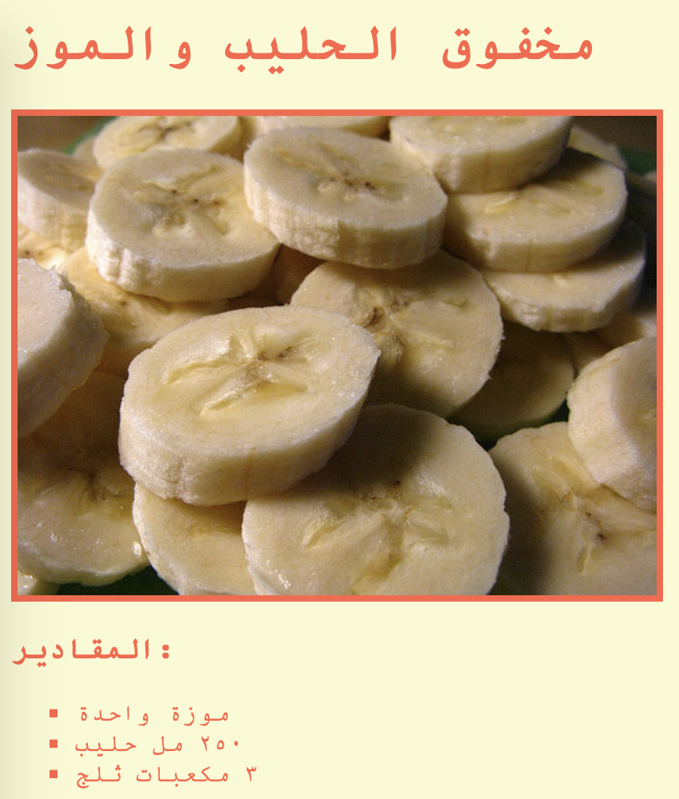

## المقدمة

في هذا المشروع، ستقوم بإنشاء صفحة ويب لوصفتك المفضلة.

### معلومات إضافية لقادة النادي

إذا كنت بحاجة إلى طباعة هذا المشروع، فيُرجى استخدام [النسخة القابلة للطباعة](https://projects.raspberrypi.org/en/projects/recipe/print).

## \--- collapse \---

## title: ملاحظات قادة النادي

## مقدمة:

في هذا المشروع، سيتعلم الاطفال عن القوائم في لغة HTML و الالوان في CSS. سيصنعون الوصفة الخاصة بهم، ويضيفون قوائم المقادير وطريقة العمل.

## الموارد المتوفرة على الإنترنت

نوصي باستخدام [trinket](https://trinket.io/) لكتابة ملفات HTML و & CSS على الإنترنت.

يمكن أن يستخدم الأطفال أيضًا ملف trinket الفارغ هذا [(jumpto.cc/html-blank)](http://jumpto.cc/html-blank) لكتابة ملفات HTML و & CSS، أو يمكنهم استخدام قالب trinket هذا [(jumpto.cc/html-template)](http://jumpto.cc/html-template).

كما يوجد مشروع trinket يحتوي على نموذج حل للتحديات:

+ [‘الوصفة النهائية’ -- trinket.io/html/c0fd9b40cd](https://trinket.io/html/c0fd9b40cd)

## الموارد المتوفرة دون اتصال بالإنترنت

هذا المشروع يمكن [إكماله دون اتصال بالإنترنت](https://www.codeclubprojects.org/en-GB/resources/webdev-working-offline/) إذا كنت تفضل ذلك. يمكنك الوصول إلى موارد المشروع من خلال النقر فوق رابط "مواد المشروع" الخاص بهذا المشروع. يحتوي هذا الرابط على قسم "موارد المشروع"، الذي يتضمن الموارد التي يحتاج إليها الأطفال لإكمال هذا المشروع من دون اتصال بالإنترنت. تأكد من أن كل طفل لديه حق الوصول إلى نسخة من هذه الموارد. يتضمن هذا القسم الملفات التالية:

+ template/index.html
+ template/style.css

يمكنك أيضًا العثور على نسخة كاملة من تحديات هذا المشروع في قسم "موارد المتطوعين" الذي يحتوي على:

+ recipe-finished/index.html
+ recipe-finished/style.css
+ recipe-finished/banana.jpg

(جميع الموارد المذكورة أعلاه قابلة للتنزيل أيضًا كملفات `.zip` للمشاريع والمتطوعين)

## أهداف التعلم

+ كتابة HTML:
    
    + قوائم علامات `<ul>`, `<ol>` و `<li>`;
    + علامات `
`;
    + دمج استخدام العلامات المتداخلة.

+ كتابة CSS:
    
    + الالوان (الاسماء و ايعازات hexadecimal).

يتناول هذا المشروع عناصر من الصفوف التالية من المناهج الرقمية الخاصة بـ [Raspberry Pi](http://rpf.io/curriculum):

+ [الأصول الأساسية للتصميمات ثنائية الأبعاد وثلاثية الأبعاد](https://www.raspberrypi.org/curriculum/design/creator).

## التحديات

"مقادير أكثر" - إضافة عناصر أكثر الى قائمة غير مرتبة; "خطوات أكثر" - إضافة عناصر أكثر الى قائمة مرتبة; "ألوان أكثر" - إضافة أسماء الوان، قيم rgb وايعازات hex; "تعليقات" - إضافة قائمة غير مرتبة أخرى; "تنسيقات أكثر" - إضافة صور وخطوط.

## إكمال هذا المشروع من دون اتصال انترنيت

اذا كان الاطفال سيكملون هذا المشروع من دون اتصال انترنيت، سيحتاجون الى خزن الصور التي يرغبون باستخدامها في نفس المجلد الموجود به ملف Template.html.

وعندها يستطيعون إضافة اسم الملف الى علامات ``:

    
    

\--- /collapse \---

## \--- collapse \---

## title: مواد المشروع

## موارد المشروع

+ [ملف.zip يحتوي على كل موارد المشروع](resources/recipe-project-resources.zip)
+ [قالب Trinket عبر الإنترنت](http://jumpto.cc/trinket-template)
+ [Trinket فارغ عبر الإنترنت](http://jumpto.cc/trinket-blank)
+ [template/index.html](resources/template-index.html)
+ [template/style.css](resources/template-style.css)

## موارد قادة النادي

+ [ملف.zip يحتوي على جميع موارد المشروع المكتملة](resources/recipe-volunteer-resources.zip)
+ [مشروع Trinket المكتمل على الإنترنت](https://trinket.io/html/c0fd9b40cd)
+ [recipe-finished/index.html](resources/recipe-finished-index.html)
+ [recipe-finished/style.css](resources/recipe-finished-style.css)
+ [recipe-finished/banana.png](resources/recipe-finished-banana.png)

\--- /collapse \---