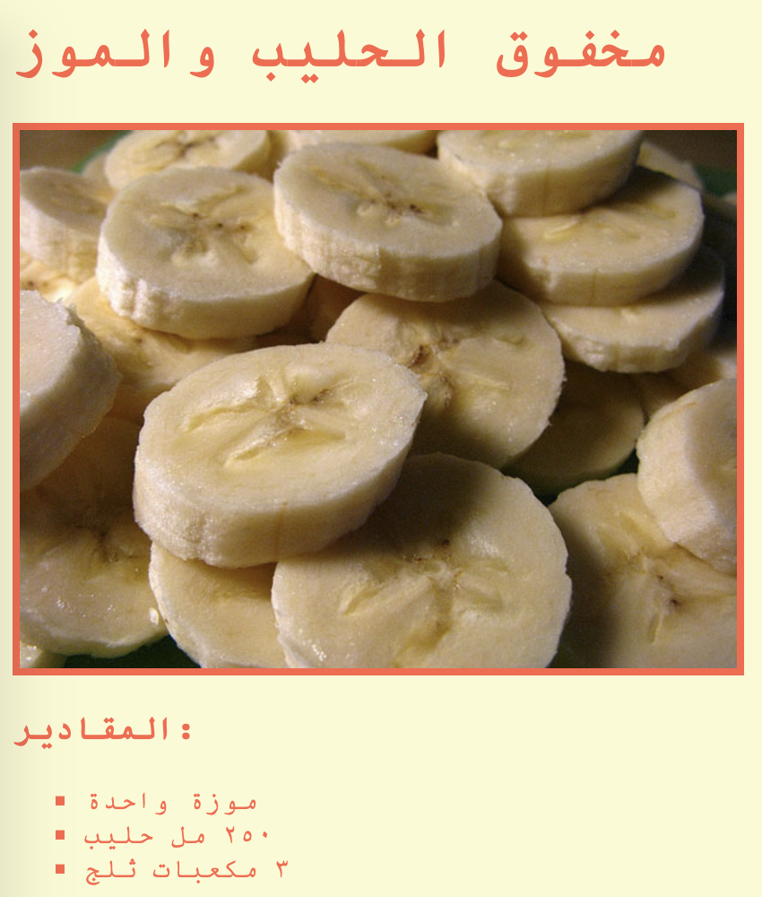

\--- challenge \---

## التحدي: تنسيقات اضافية

هل تستطيع إضافة صورة الى موقع الويب الخاص بك؟ أو تغيير نوع الخط؟ إليك كيف يمكن أن تبدو صفحة الويب الخاصة بك:

إليك بعض التعليمات البرمجية التي ستساعدك:

    font-family: Arial / Comic Sans MS / Courier / Impact / Tahoma;
    font-size: 12pt;
    font-weight: bold;
    
    
    

\--- challenge/ \---