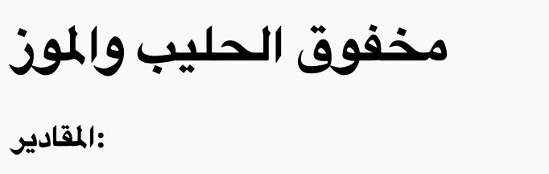
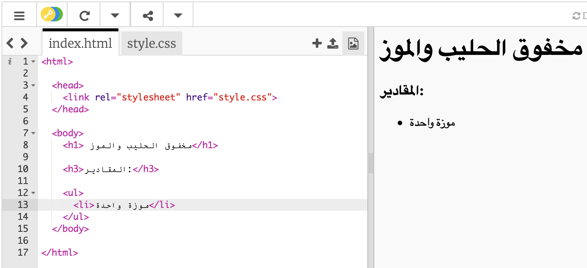

## المقادير

دعونا نقم بتعداد المقادير التي نحتاجها لوصفتكم.

+ أفتح رابط trinket التالي: [jumpto.cc/html-template](http://jumpto.cc/html-template){:target="_blank"}.
    
    الآن يجب أن يبدو الملف الخاص بك مثل هذا:
    
    

+ لقائمة المقادير خاصتك، ستقوم باستخدام **قائمة غير مرتبة unorded list** بإستخدام علامة `<ul>`. إذهب الى السكر رقم ٨ من المشروع النموذج وقم بإضافة هذه الكود بلغة HTML، حيث تقوم باستبدال النص في عنوان `<h1>` باسم الوصفة الخاصة بك:

    <h1>مخفوق الحليب والموز</h1>
    
    <h3>المقادير:</h3>
    
    <ul>
    
    </ul>
    

+ قم بعرض موقعك الالكتروني، ويحب أن ترى عناوينك الاثنين.

ولكنك لن ترى القائمة بعد، وذلك لانك لم تقم بإضافة أي عناصر للقائمة بعد!

+ في الخطوة التالية سنقوم بإضافة عناصر للقائمتك، باستخدام العلامة `<li>`. قم بإضافة الكود التالي داخل علامة `<ul>`:

    <li>موزة واحدة</li>
    

بما إن قائمتك غير مرتبة، فلا يوجد أرقام بجانب عناصر القائمة، فقط نقاط.