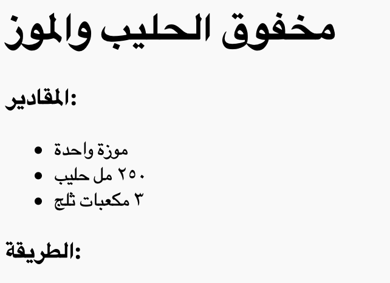
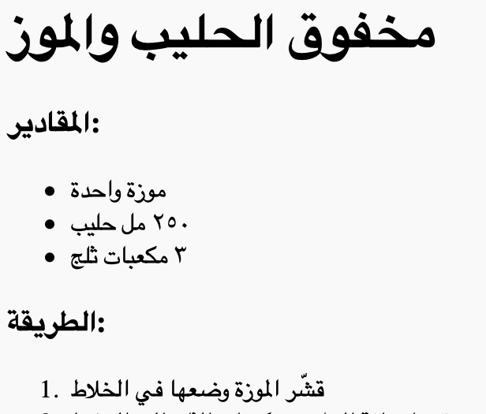

## طريقة التحضير

لنشرح الآن كيفية تحضير وصفة الطعام.


+ ستستخدم قائمة أخرى لكتابة طريقة التحضير، لكنك ستستخدم __قائمة مرتبة__ هذه المرة مستخدمًا الوسم `<ol>`.

القائمة المرتبة هي القائمة المرقمة، وتستخدم هذا النوع من القوائم عندما يكون ترتيب الخطوات مهمًا.

أضف هذه التعليمة البرمجية أسفل قائمة المكونات، وتأكد من أنها داخل الوسم `<body>`:

```
<h3>طريقة التحضير:</h3>

<ol>

</ol>
```



+ كل ما تحتاج إليه الآن هو إضافة عناصر القائمة إلى قائمتك المرتبة الجديدة:

```
<li>قشِّر الموزة وضعها في الخلاط</li>
```



لاحظ أن عناصر القائمة مرتبة تلقائيًا!

