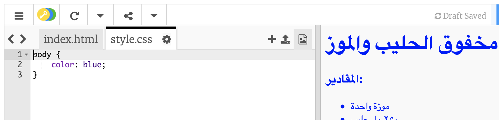
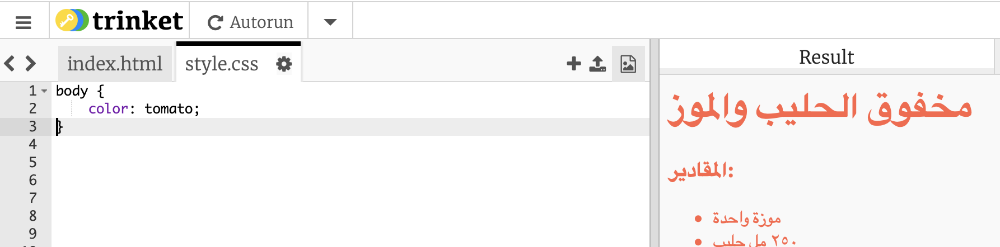
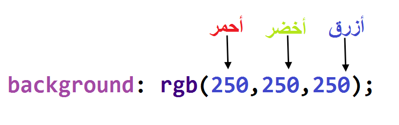
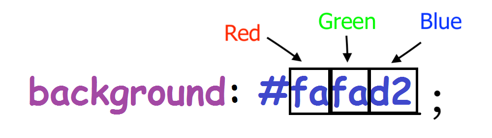
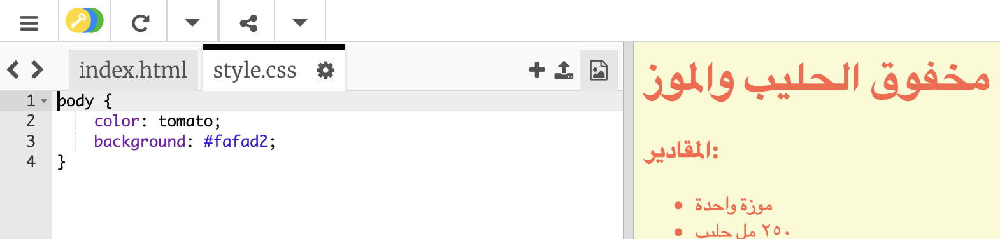

## الألوان!

دعنا نضيف بعض الألوان إلى صفحة الوصفات الخاصة بك.

+ لقد تعلمت كيف تضيف نص ملوّن في صفحتك. قم بإضافة هذه الكود داخل ملف `style.css`، لجعل كل النص داخل الصفحة أزرق اللون:

    body {
        color: blue;
    }
    

+ إن متصفح الانترنت لديك يعرف اللون `الازرق` و `الاصفر` وحتى `الاخضر الفاتح`، ولكن هل كنت تعرف حقيقة أن متصفحك يعرف **الاسماء** الخاصة باكثر من ١٤٠ لون مختلف؟

توجد قائمة بجميع أسماء الألوان التي يمكنك استخدامها: [jumpto.cc/colours](http://jumpto.cc/colours) ، والتي تتضمن أسماء ألوان مثل `طماطم` ، `طوب نار` و `خوخ` .

قم بتغيير لون النص من `الازرق` إلى `طماطم`.

+ إن متصفح الانترنيت خاصتك يعرف الاسماء لـ١٤٠ لون، ولكن في الحقيقة فهو يعرف **قيم الالوان** لاكثر من ١٦ مليون لون!

حتى تخبر المتصفح أي لون يعرضه، عليك أن تخبره كم هو مقدار اللون الاحمر، والاخضر والازرق المستخدم.

إن مقدار اللون الاحمر والاخضر والازرق مكتوب بشكل رقم بين `0` و `255`.

أضف هذه التعليمات البرمجية إلى CSS لنص صفحة الويب، لعرض خلفية صفراء فاتحة:

    background: rgb(250,250,210);
    

+ إذا كنت تفضل، يمكنك أن تخبر المتصفح أي لون ليعرضه وذلك باستخدام كود hexadecimal أو (**كود hex**). هذا يعمل بشكل مشابه لكود `rgb()` في الاعلى، مع فارق أن كود hex دائما تبدأ بـ `#`، وتستخدم أرقام بالنظام العشري بين `00` و `ff` لمقدار الاحمر والاخضر والازرق.

استبدل الكود `rgb()` في CSS بكود hex هذه:

    background: #fafad2;
    

يجب أن ترى الاصفر الفاتح كما في السابق!