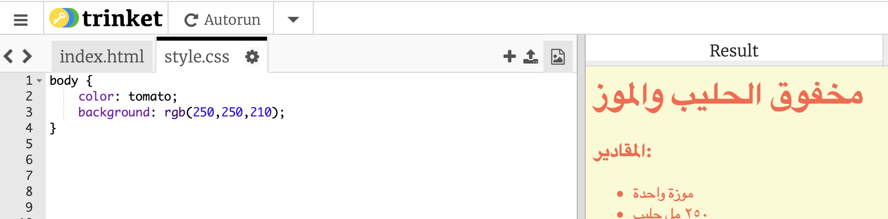

## الألوان!

دعونا نقوم بإضافة بعض الالوان الى صفحتك.

+ لقد تعلمت كيف تضيف نص ملوّن في صفحتك. قم بإضافة هذه الكود داخل ملف `style.css`، لجعل كل النص داخل الصغحة أزرق اللون:

    body {
        color: blue;
    }
    

+ إن متصفح الانترنيت لديك يعرف اللون `الازرق` و `الاصفر` وحتى `الاخضر الفاتح`، ولكن هل كنت تعرف حقيقة أن متصفحك يعرف **الاسماء** الخاصة باكثر من ١٤٠ لون مختلف؟

هناك قائمة بأسماء جميع الاوان، يمكنك أن تستخدم الموقع:[jumpto.cc/colours](http://jumpto.cc/colours), والذي يحوي اسماء الالوان مثل ` tomato`، و` firebrick` و ` peachpuff`.

غيّر لون الخط من `الازرق` الى `tomato`.

+ إن متصفح الانترنيت خاصتك يعرف الاسماء لـ١٤٠ لون، ولكن في الحقيقة فهو يعرف **قيم الالوان** لاكثر من ١٦ مليون لون!

حتى تخبر المتصفح أي لون يعرضه، عليك أن تخبره كم هو مقدار اللون الاحمر، والاخضر والازرق المستخدم.

إن مقدار اللون الاحمر والاخضر والازرق مكتوب بشكل رقم بين `0` و `255`.

Add this code to the CSS for the body of the webpage, to display a light yellow background:

    background: rgb(250,250,210);
    

+ If you prefer, you can tell the browser which colour to display by using a hexadecimal code (or **hex code**). This works in a similar way to the `rgb()` code above, except that hex codes always start with a `#`, and use hexadecimal ‘numbers’ between `00` and `ff` for the amount of red, green and blue.

Replace the `rgb()` code in your CSS with this hex code:

    background: #fafad2;
    

You should see the same light yellow as before!