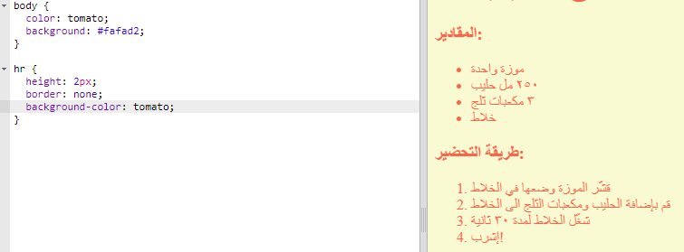

## اللمسات الأخيرة

لنضِف بعض تعليمات HTML وCSS الأخرى لتحسين شكل صفحة الويب.


+ يمكنك إضافة خط أفقي في نهاية وصفة الطعام باستخدام الوسم `<hr>`.


لاحظ أن هذا الوسم ليس له علامة نهاية، تمامًا كالوسم ``.

+ لا يتناسب الخط الذي أضفته للتو مع نمط صفحة الويب. لنصلح ذلك بإضافة بعض تعليمات CSS البرمجية:

```
hr {
    height: 2px;‎
    border: none;‎
    background-color: tomato;‎
}
```



+ يمكنك أيضًا تغيير مظهر رموز التعداد النقطي باستخدام تعليمة CSS البرمجية هذه:

```
ul {
    list-style-type: square;‎
}
```


