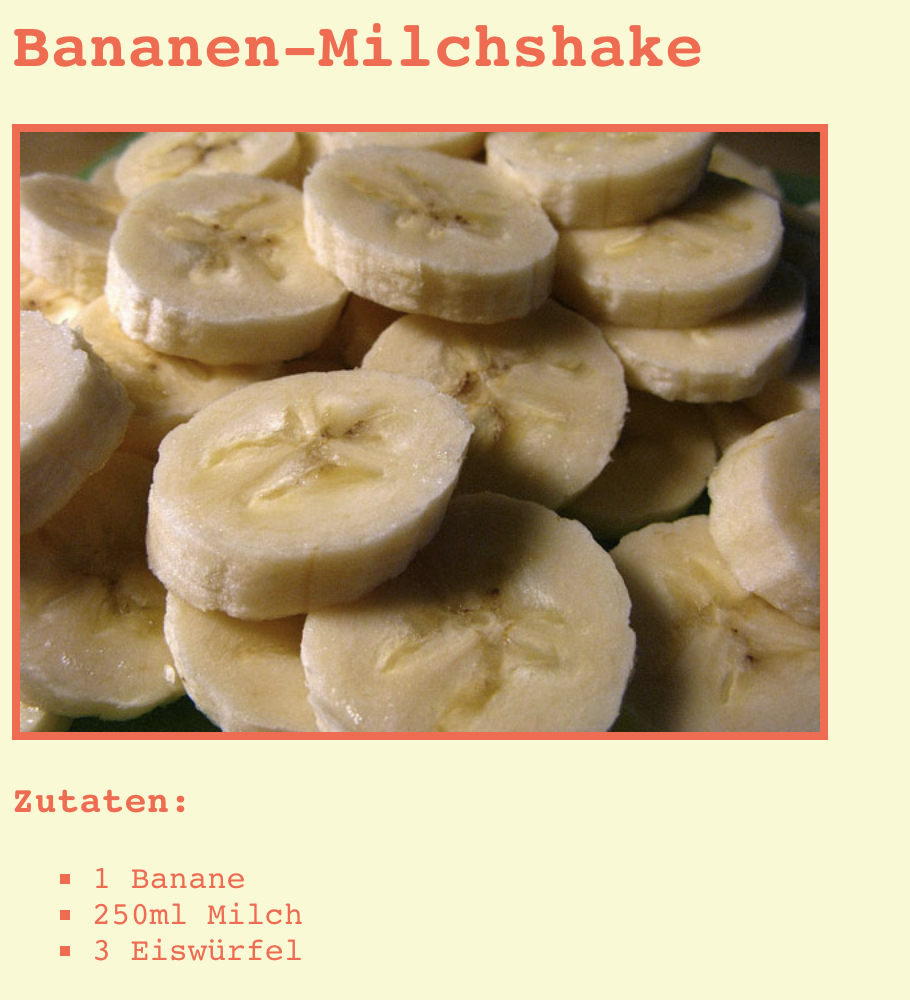

## Einleitung

In this project, you’ll learn how to create a webpage for your favourite recipe.

### Zusätzliche Information für Clubleiter

Falls du dieses Projekt ausdrucken musst, verwende bitte die [druckfreundliche Version](https://projects.raspberrypi.org/en/projects/recipe/print).

## \--- collapse \---

## title: Anmerkungen für Clubleiter

## Einleitung:

In this project, children will learn about HTML lists and CSS colours. They will create their own recipe, adding ingredient and method lists.

## Online-Ressourcen

We recommend using [trinket](https://trinket.io/) to write HTML & CSS online.

Die Kinder können auch dieses leere Trinket [(jumpto.cc/html-blank)](http://jumpto.cc/html-blank) verwenden um ihr eigenes HTML & CSS zu schreiben, oder sie können als Alternative dazu dieses Trinket als Vorlage verwenden [(jumpto.cc/html-template)](http://jumpto.cc/html-template).

Es gibt auch ein Trinket mit einer Beispiellösung für die Herausforderungen:

+ [‘Recipe’ Finished -- trinket.io/html/c0fd9b40cd](https://trinket.io/html/c0fd9b40cd)

## Offline-Ressourcen

Dieses Projekt kann wahlweise auch [offline](https://www.codeclubprojects.org/en-GB/resources/webdev-working-offline/) durchgeführt werden. Sie können auf die Projektressourcen zugreifen, indem Sie auf den Link "Projektmaterial" für dieses Projekt klicken. Dieser Link enthält einen Abschnitt "Projektressourcen" mit Ressourcen, die die Kinder benötigen, um das Projekt offline abschließen zu können. Stelle sicher, dass jedes Kind Zugriff auf eine Kopie dieser Ressourcen hat. Dieser Abschnitt enthält die folgenden Dateien:

+ template/index.html
+ template/style.css

Eine vollständige Version dieses Projekts finden Sie auch im Abschnitt "Ressourcen für Freiwillige". Diese enthält:

+ recipe-finished/index.html
+ recipe-finished/style.css
+ recipe-finished/banana.jpg

(Alle oben genannten Ressourcen können auch als `.zip`-Dateien für Projekte und für Freiwillige heruntergeladen werden.)

## Lernziele

+ Writing HTML:
    
    + `<ul>`, `<ol>` and `<li>` list tags;
    + `
` tag;
    + Consolidating the use of nested tags.

+ Writing CSS:
    
    + Colours (names & hexadecimal codes).

Dieses Projekt deckt die folgenden Kernbereiche des [Raspberry Pi Digital Making Curriculum](http://rpf.io/curriculum) ab:

+ [Entwurf von grundlegenden 2D- and 3D-Konstruktionen](https://www.raspberrypi.org/curriculum/design/creator).

## Herausforderungen

"More ingredients" - adding more items to an unordered list; "More steps" - adding more items to an ordered list; "More colours" - adding colour names, rgb values and hex codes; "Reviews" - adding another unordered list; "More styling" - adding images and fonts.

## Completing this project offline

If children are completing this project offline, they’ll need to save images they intend to use in the same folder as their Template.html file.

They can then just add the name of the file in their `` tags:

    
    

\--- /collapse \---

## \--- collapse \---

## title: Projektmaterial

## Projektressourcen

+ [.zip-Datei, die alle Projektressourcen enthält](resources/recipe-project-resources.zip)
+ [Online Trinket-Vorlage](http://jumpto.cc/trinket-template)
+ [Leeres online-Trinket](http://jumpto.cc/trinket-blank)
+ [template/index.html](resources/template-index.html)
+ [template/style.css](resources/template-style.css)

## Ressourcen für Clubleiter

+ [.zip-Datei, die alle fertig gestellten Projektressourcen enthält](resources/recipe-volunteer-resources.zip)
+ [Vollständiges Trinket-Projekt (online)](https://trinket.io/html/c0fd9b40cd)
+ [recipe-finished/index.html](resources/recipe-finished-index.html)
+ [recipe-finished/style.css](resources/recipe-finished-style.css)
+ [recipe-finished/banana.png](resources/recipe-finished-banana.png)

\--- /collapse \---