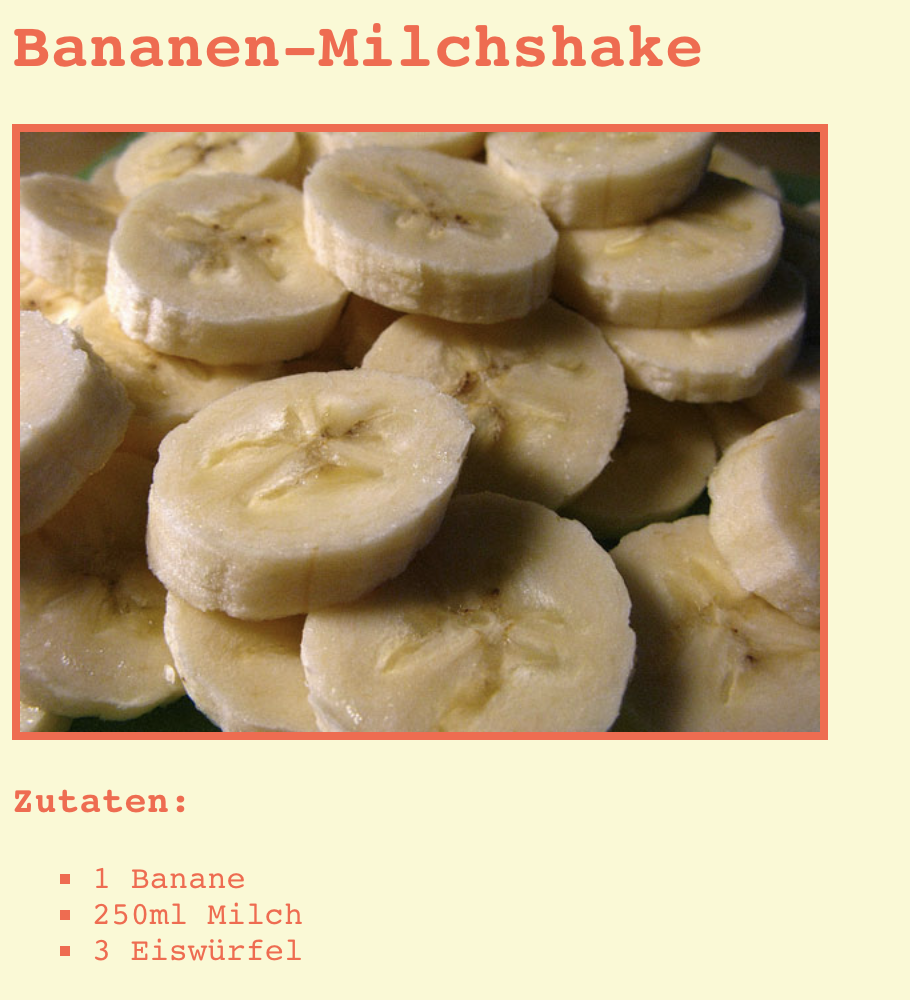

\--- challenge \---

## Aufgabe: Noch mehr Gestaltungsmöglichkeiten

Kannst du ein Bild zu deiner Webseite hinzufügen? Oder die Schriftart verändern? Hier siehst du, wie deine Webseite aussehen könnte:

Hier ist ein Code, der dir helfen wird:

    font-family: Arial / Comic Sans MS / Courier / Impact / Tahoma;
    font-size: 12pt;
    font-weight: bold;
    
    
    

\--- /challenge \---