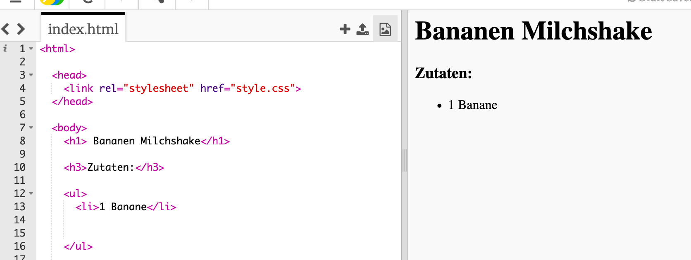

## Zutaten

Lass uns die Zutaten, die wir für dein Rezept brauchen, auflisten.

+ Öffne dieses Beispiel-Trinket: [jumpto.cc/html-template](http://jumpto.cc/html-template){:target="_blank"}.
    
    Das Projekt sollte so aussehen:
    
    

+ Für deine Zutatenliste wirst du eine **ungeordnete Liste** mit dem `<ul>` Tag verwenden. Gehe zur Zeile 8 des Templates und füge den folgenden HTML Code hinzu, und ersetze den Text in die `<h1>` Überschrift mit dem Namen deines eigenen Rezeptes:

    <h1>Bananen-Milchshake</h1>
    
    <h3>Zutaten:</h3>
    
    <ul>
    
    </ul>
    

+ Besuche deine Webseite, und du solltest zwei Überschriften sehen.

Du wirst allerdings deine Liste noch nicht sehen, weil du noch keine Punkte zu ihr hinzugefügt hast!

+ Als Nächstes werden wir Listenpunkte zu deiner Liste hinzufügen. Benütze dafür das `<li>` Tag. Add the following code inside your `<ul>` tag:

    <li>1 banana</li>
    

As your list is unordered, there are no numbers next to the list items, just bullet points.