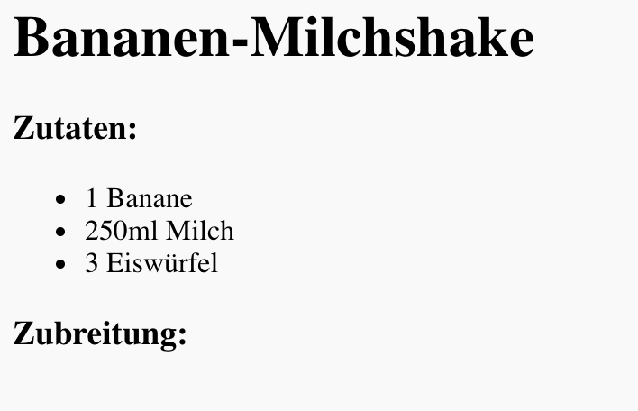
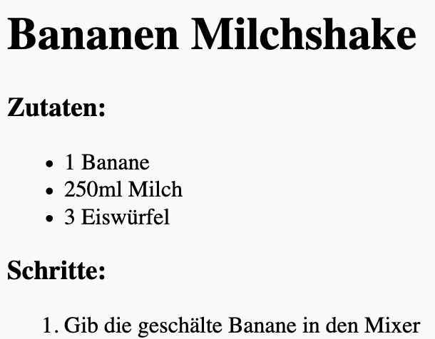

## Zubreitung

Lass uns nun erklären, wie man dein Rezept zubereitet.

+ Du wirst noch eine Liste für die Zubereitung verwenden, aber dieses mal wirst du eine **geordnete** Liste mit dem `<ol>` Tag verwenden.

Eine geordnete Liste ist eine nummerierte Liste, die du verwenden solltest, wenn die Reihenfolge der Schritte wichtig ist.

Verwenden den Code unterhalb deiner Zutatenliste, und stelle sicher, dass er in deinem `<body>` Tag ist:

    <h3>Zubereitung:</h3>
    
    <ol>
    
    </ol>
    

+ Jetzt kannst du Listenpunkte zu deiner neuen geordneten Liste hinzufügen:

    <li>Schäle die Banane und gib sie in den Mixer</li>
    

Siehst du, dass die Listenpunkte automatisch nummeriert sind?