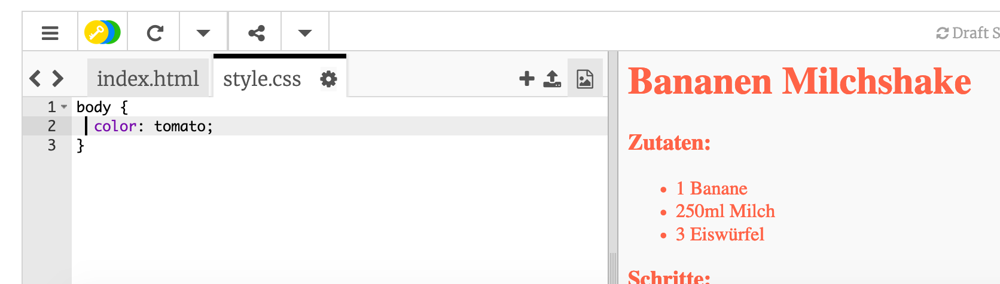
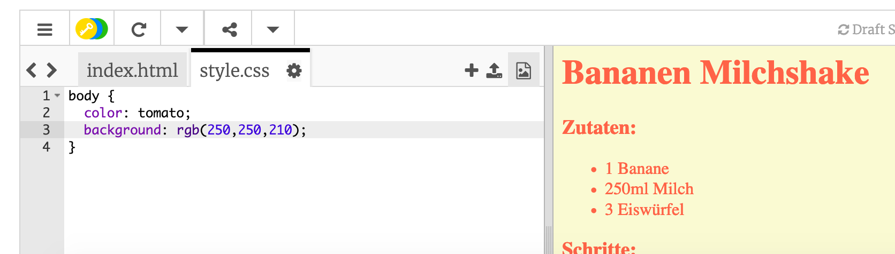

## Farben!

Lass uns ein paar Farben zu deiner Rezept-Webseite hinzufügen.

+ Du hast bereits gelernt, wie man bunten Text zu einer Webseite hinzufügt. Füge diesen Code in deiner `style.css` Datei hinzu, damit der gesamte Text auf deiner Webseite Blau erscheint:

```
body {
    Farbe: Blau;
}
```


+ Dein Browser kennt Farben wie `blue` (Blau), `yellow` (Gelb) und auch `lightgreen` (Hellgrün), wusstest du aber, dass dein Browser tatsächlich die __Farbnamen__ von mehr als 500 verschiedenen Farben kennt?

Es gibt eine Liste an Farbnamen, die du benutzen kannst: Gehe zu [jumpto.cc/colours](http://jumpto.cc/colours) dort findest du Farbnamen wie `tomato` (Tomate), `firebrick` (Feuerziegel) und `peachpuff` (Pfirsichhauch).

Ändere die Textfarbe von `blue` (Blau) zu `tomato` (Tomate).



+ Dein Browser kennt nicht nur die Namen von 140 Farben, sondern er kennt tatsächlich auch die __Farbwerte__ von über 16 Millionen Farben!


Um dem Browser mitteilen zu können, welche Farbe er anzeigen soll, musst du nur sagen können, wie viel Rot, Grün und Blau benutzt werden soll.

Die Menge an Rot, Grün und Blau wird als Ziffer zwischen `0` und `255` geschrieben.


Füge diesen Code zum CSS für den Body deiner Webseite hinzu, um einen hellgelben Hintergrund anzuzeigen:

```
Hintergrund: rgb(250,250,210);
```



+ Wenn du magst, kannst du dem Browser sagen, welche Farbe er anzeigen soll, indem du den Hexadezimal Code (oder __hex code__) benutzt. Dies funktioniert ähnlich zum `rgb()` Code, wie oben beschrieben, mit Ausnahme, dass der Hexadezimal Code immer mit einem Rautenzeichen beginnt `#` und man die Hexadezimal ‘Zahlen’ zwischen `00` und `ff` für die Menge an Rot, Grün und Blau benutzt.


Ersetze den `rgb()` Code in deinem CSS mit diesem Hexadezimal Code:

```
Hintergrund: #fafad2;
```


Du solltest jetzt das gleiche Hellgelb wie zuvor sehen können!
