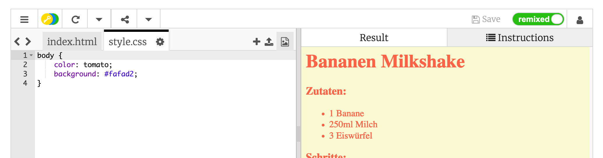

## Farben!

Lass uns Farben zu deiner Rezept-Webseite hinzufügen.

+ Du hast bereits gelernt, wie man farbigen Text zu einer Webseite hinzufügt. Füge den unten stehenden Code in deine `style.css` Datei, um den gesamten Text in deinem Webseite body blau zu machen:

    body {
        color: blue;
    }
    

+ Dein Browser kennt Farben wie `blue`, `yellow` und sogar `lightgreen`, aber hast du gewusst, dass dein Browser tatsächlich die **Namen** von 140 verschiedenen Farben kennt?

Es gibt eine List von allen Farbnamen, die du benützen kannst: [umpto.cc/colours](http://jumpto.cc/colours), welche Farbnamen wie `tomato`, `firebrick` und `peachpuff`.

Verändere die Textfarbe von `blue` zu `tomato`.

+ Dein Browser kennt die Namen von 140 Farben, aber kennt eigentlich die **Farbwerte** von mehr als 16 Millionen Farben!

Um dem Browser zu sagen, welche Farbe er darstellen soll, musst du ihn nur wissen lassen, wie viel rot, grün und blau er verwenden soll.

Die Mengen an rot, grün und blau werden als eine Nummer zwischen `0` und `255` geschrieben.

Füge diesen Code zu deinem CSS für den body der Webseite, um einen gelben Hintergrund darzustellen:

    background: rgb(250,250,210);
    

+ Wenn du möchtest, kannst du dem Browser auch mit dem Hexadezimal-Code (oder **hex code**) mitteilen, welche Farbe er darstellen soll. Das funktioniert so ähnlich wie der `rgb()` überhalb, außer dass hex codes immer mit `#` starten, und hexadezimale "Nummern" zwischen `00` und `ff` für die Menge an rot, grün und blau verwenden.

Ersetze den `rgb()` Code in deinem CSS mit diesem hex code:

    background: #fafad2;
    

Du solltest die selbe Farbe wie zuvor sehen!