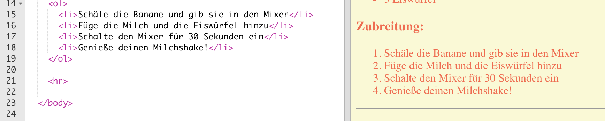
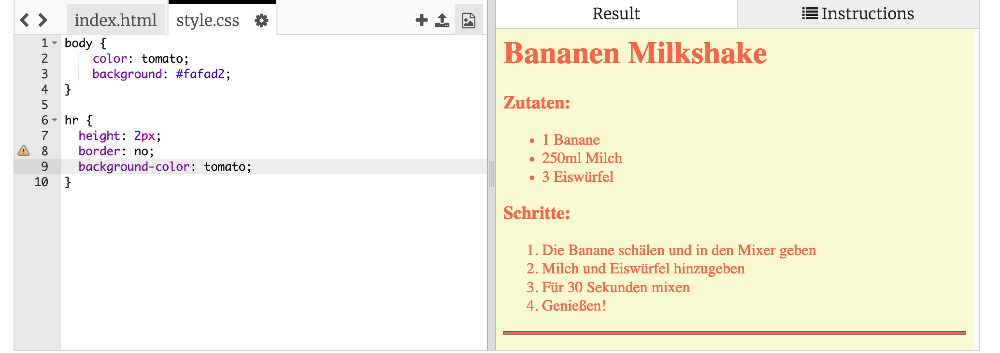
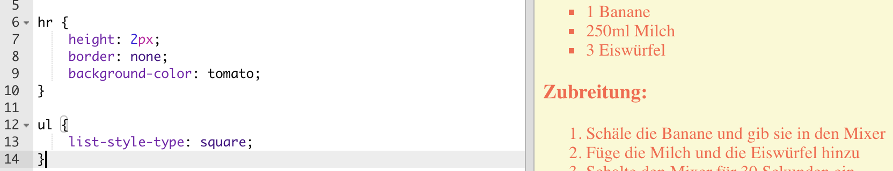

## Der letzte Schliff

Lass uns noch mehr HTML und CSS hinzufügen, um deine Webseite zu verbessern.

+ Du kannst eine horizontale Linie am Ende deines Rezeptes hinzufügen, wenn du das `
` Tag benützt.

Beachte, dass dieses Tag kein End-Tag hat, genau wie das `` Tag.

+ The line you’ve just added doesn’t match the style of the rest of your webpage. Let’s fix that by adding some CSS code:

    hr {
        height: 2px;
        border: none;
        background-color: tomato;
    }
    

+ You can even change how your bullet points look with this CSS code:

    ul {
        list-style-type: square;
    }
    

