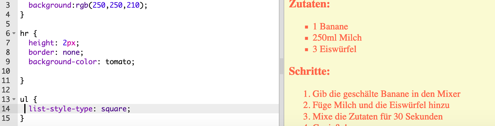

## Der letzte Schliff

Lass uns noch mehr HTML und CSS hinzufügen, um deine Webseite zu verbessern.

+ Du kannst eine horizontale Linie am Ende deines Rezeptes hinzufügen, wenn du das `<hr>` Tag benützt.


Beachte, dass dieses Tag kein End-Tag hat, genau wie das `` Tag.

+ Die Linie, du du gerade hinzugefügt hast, passt nicht so recht zum Rest deiner Webseite. Lass uns das mit etwas CSS Code beheben:

```
hr {
    height: 2px;
    border: none;
    background-color: tomato;
}
```  


+ Du kannst sogar das Aussehen der Listenpunkte mit diesem CSS Code verändern:

```
ul {
    list-style-type: square;
}
``` 

