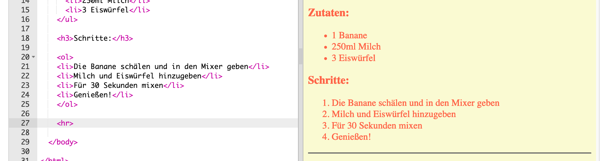

## Der letzte Schliff

Lass uns noch etwas mehr HTML- und CSS-Code hinzufügen, um deine Webseite zu verbessern.

+ Du kannst eine horizontale Linie am Ende deines Rezepts einfügen, indem du das <hr> Tag benutzt.



Hast du bemerkt, dass dieses Tag kein End-Tag besitzt, genau wie das `` Tag?

+ Die Zeile, die du soeben eingefügt hast, passt allerdings nicht zum Rest deiner Webseite. Lass uns das beheben, indem wir weiteren CSS-Code hinzufügen:

```
hr {
    Höhe: 2px;
    Grenze: keine;
    Hintergrundfarbe: Tomate;
}
```


+ Du kannst mit Hilfe dieses CSS-Codes sogar auch ändern, wie deine Gliederungspunkte aussehen sollen:

```
ul {
    Listenstil Art: quadratisch;
}
```


