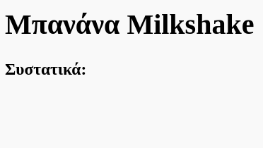
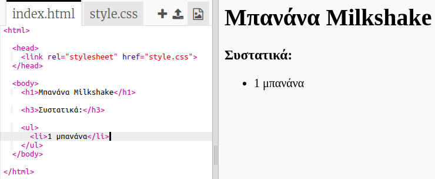

## Συστατικά

Ας απαριθμήσουμε τα συστατικά που χρειάζονται για τη συνταγή σου.

+ Άνοιξε αυτό το πρότυπο trinket: [jumpto.cc/html-template](http://jumpto.cc/html-template){:target="_blank"}.
    
    Το έργο πρέπει να μοιάζει έτσι:
    
    

+ Για τη λίστα των συστατικών, θα χρησιμοποιήσεις μία **μη αριθμημένη λίστα**, χρησιμοποιώντας την ετικέτα `<ul>`. Πήγαινε στη γραμμή 8 του προτύπου και πρόσθετε αυτόν τον HTML κώδικα, αντικαθιστώντας το κείμενο στον `<h1>` τίτλο με το όνομα της δικής σου συνταγής:

    <h1>Μπανάνα Milkshake</h1>
    
    <h3>Συστατικά:</h3>
    
    <ul>
    
    </ul>
    

+ Κάνε προβολή της ιστοσελίδας σου. Θα πρέπει να δεις τις δύο επικεφαλίδες.

Ωστόσο, δεν θα δεις τη λίστα σου επειδή δεν έχεις προσθέσει κανένα στοιχείο ακόμα!

+ Το επόμενο βήμα είναι να προσθέσεις στοιχεία στη λίστα σου, χρησιμοποιώντας την ετικέτα `<li>`. Πρόσθεσε τον ακόλουθο κώδικα μέσα στην ετικέτα `<ul>`:

    <li>1 μπανάνα</li>
    

Καθώς η λίστα σου δεν είναι αριθμημένη, δεν υπάρχουν αριθμοί αλλά κουκίδες δίπλα στα στοιχεία της.