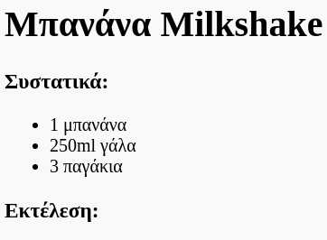
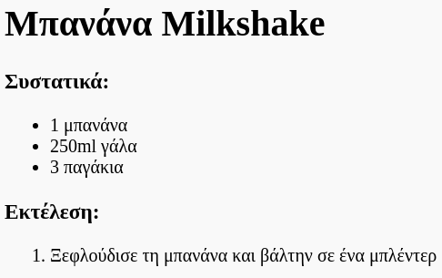

## Εκτέλεση

Στη συνέχεια, ας εξηγήσουμε πώς φτιάχνεις τη συνταγή σου.

+ Θα χρησιμοποιήσεις μια άλλη λίστα για να γράψεις την εκτέλεση, αλλά αυτή τη φορά θα χρησιμοποιήσεις μια **αριθμημένη λίστα**, με την ετικέτα `<ol>`.

Μια αριθμημένη λίστα έχει αριθμούς μπροστά από τα στοιχεία και χρησιμοποιείται όταν η σειρά των βημάτων είναι σημαντική.

Πρόσθεσε αυτόν τον κώδικα κάτω από τη λίστα συστατικών, σιγουρεύοντας ότι είναι μέσα στην ετικέτα `<body>`:

    <h3>Εκτέλεση:</h3>
    
    <ol>
    
    </ol>
    

+ Τώρα πρέπει απλά να προσθέσεις στοιχεία στη νέα αριθμημένη λίστα:

    <li>Ξεφλούδισε τη μπανάνα και βάλτην σε ένα μίξερ</li>
    

Παρατήρησε ότι τα στοιχεία λίστας αριθμούνται αυτόματα!