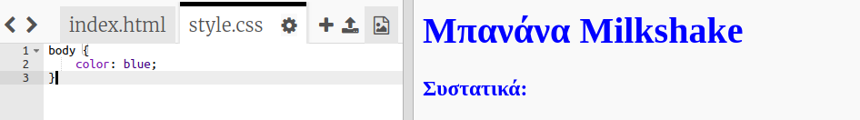
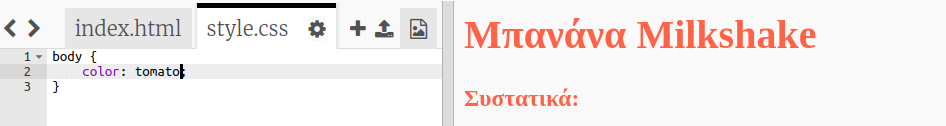
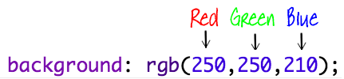
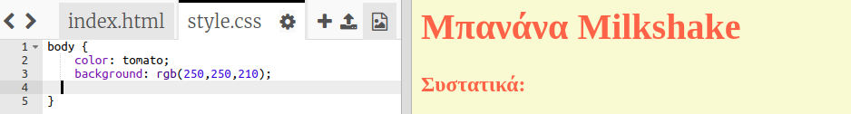
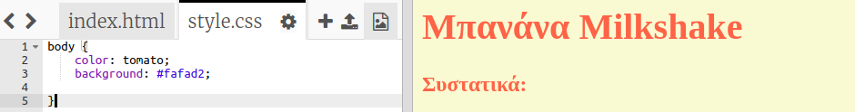

## Χρώματα!

Ας προσθέσουμε λίγο χρώμα στην ιστοσελίδα συνταγών σας.

+ Έχετε ήδη μάθει πώς να προσθέσετε έγχρωμο κείμενο σε μια ιστοσελίδα. Πρόσθεσε αυτόν τον κώδικα στο αρχείο `style.css` για να κάνεις μπλε όλο το κείμενο της ιστοσελίδας:

    body {
        color: blue;
    }
    

+ Το πρόγραμμα περιήγησης που χρησιμοποιείς γνωρίζει χρώματα όπως `μπλε` και `κίτρινο`, ακόμη και `ανοιχτό πράσινο`, αλλά ήξερες ότι γνωρίζει τα **ονόματα** πάνω από 140 διαφορετικά χρώματα;

Υπάρχει μια λίστα με όλα τα ονόματα χρωμάτων που μπορείς να χρησιμοποιήσεις: [jumpto.cc/colours](http://jumpto.cc/colours), η οποία περιλαμβάνει ονόματα όπως `tomato`, `firebrick` και `peachpuff`.

Άλλαξε το χρώμα κειμένου από `blue` σε `tomato`.

+ Το πρόγραμμα περιήγησης γνωρίζει τα ονόματα 140 χρωμάτων, αλλά στην πραγματικότητα γνωρίζει τις **τιμές χρωμάτων** για περισσότερα από 16 εκατομμύρια χρώματα!

Για να πεις στο πρόγραμμα περιήγησης ποιο χρώμα να εμφανίσει, πρέπει απλά να του πεις πόσο κόκκινο, πράσινο και μπλε θα χρησιμοποιήσει.

Οι ποσότητες κόκκινου, πράσινου και μπλε γράφονται ως αριθμός μεταξύ του `0` και του `255`.

Πρόσθεσε αυτόν τον κώδικα στο αρχείο style. css για το σώμα της ιστοσελίδας, ώστε να εμφανίσει ένα ανοιχτό κίτρινο φόντο:

    background: rgb(250,250,210);
    

+ Αν προτιμάς, μπορείς να δηλώσεις στο πρόγραμμα περιήγησης ποιο χρώμα θα εμφανίσει χρησιμοποιώντας ένα δεκαεξαδικό κώδικα (ή **hex code**). Αυτό γίνεται με τον ίδιο τρόπο όπως στον παραπάνω κώδικα `rgb()`, με εξαίρεση ότι οι hex κωδικοί αρχίζουν πάντα με `#` ακολουθούμενοι από δεκαεξαδικούς αριθμούς μεταξύ `00` και `ff` για την ποσότητα κόκκινου, πράσινου και μπλε.

Αντικατέστησε τον κώδικα `rgb()` στο αρχείο style.css με αυτόν τον δεκαεξαδικό κώδικα:

    background: #fafad2;
    

Θα πρέπει να βλέπεις το ίδιο ανοιχτό κίτρινο φόντο όπως και πριν!