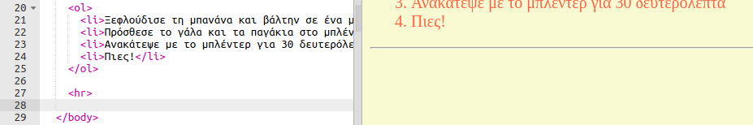
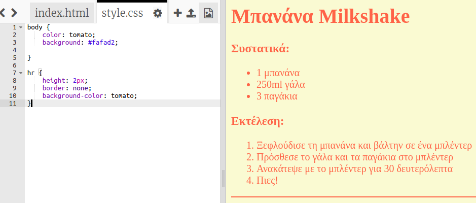
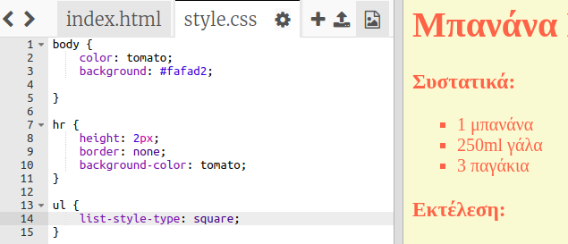

## Τελευταίες πινελιές

Ας προσθέσουμε λίγο περισσότερο HTML και CSS για να βελτιώσεις την ιστοσελίδα σου.

+ Μπορείς να προσθέσεις μια οριζόντια γραμμή στο τέλος της συνταγής σου, χρησιμοποιώντας την ετικέτα `
`.

Παρατήρησε ότι αυτή η ετικέτα δεν έχει τελική ετικέτα, όπως και η ετικέτα ``.

+ Η γραμμή που μόλις πρόσθεσες δεν ταιριάζει με το στυλ της υπόλοιπης ιστοσελίδας σου. Ας το διορθώσουμε προσθέτοντας κώδικα CSS:

    hr {
        height: 2px;
        border: none;
        background-color: tomato;
    }
    

+ Μπορείς ακόμη να αλλάξεις την εμφάνιση των κουκίδων με αυτόν τον κώδικα CSS:

    ul {
        list-style-type: square;
    }
    

