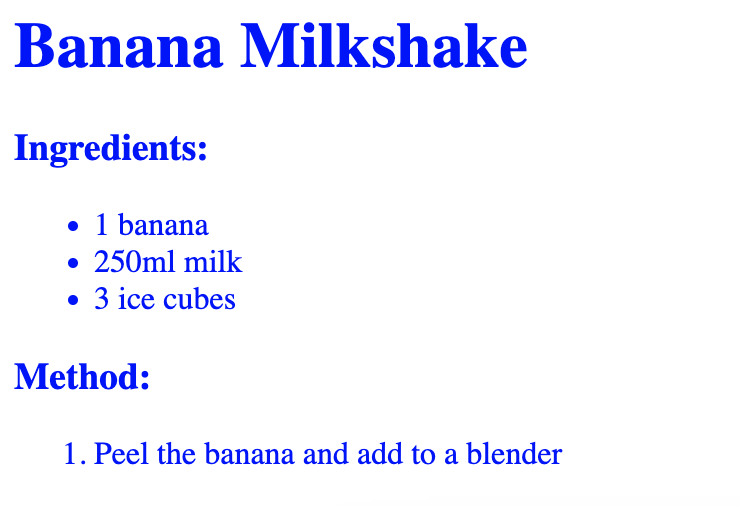
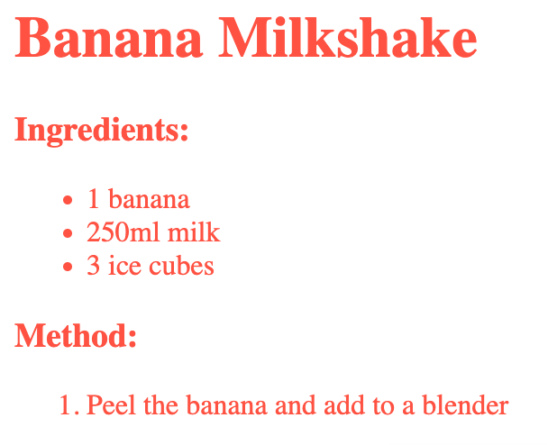

## Colours

--- task ---
Click on the `style.css` file in the sidebar. 

--- /task ---

--- task ---
Add this code to make all of the text blue:

--- code ---
---
language: css
line_numbers: true
line_number_start: 1
---
body {
    color: blue;
}
--- /code ---
--- /task ---

--- task---
Click **Run** to see the results.

--- /task ---

--- task ---
Choose a colour from this [list of colours](http://jumpto.cc/colours){:target="_blank"}.

Change the text colour from `blue` to your chosen colour, then click **Run** to see the result.

--- /task ---

