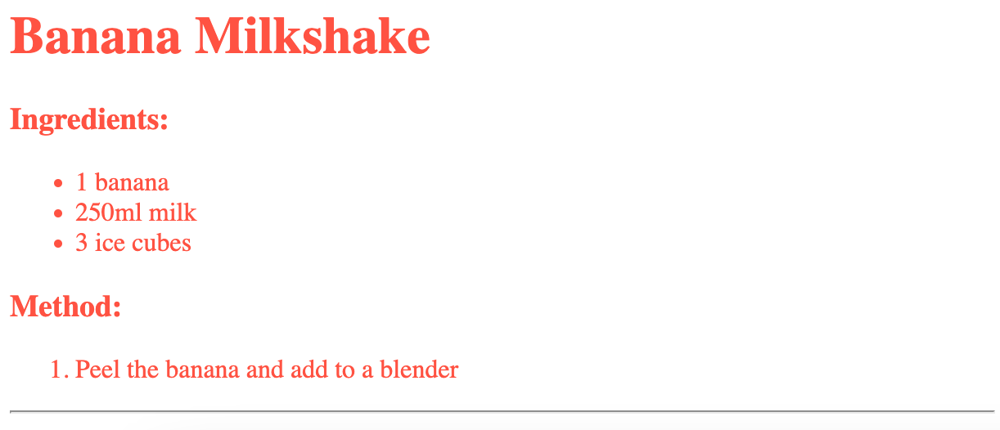
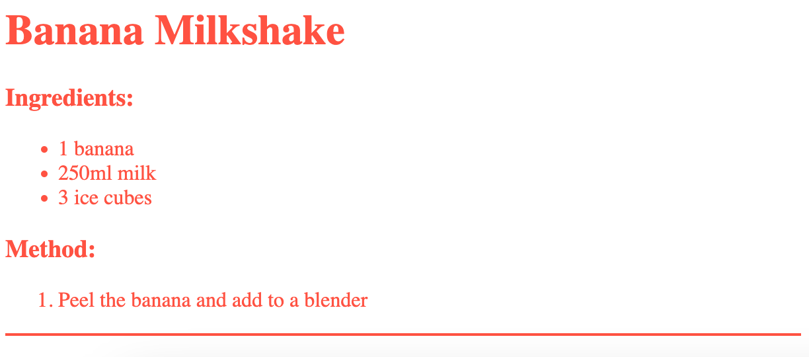
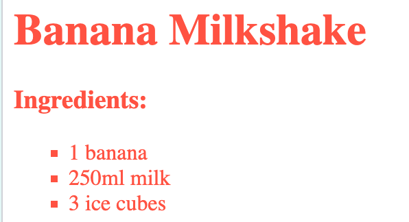

## Finishing touches

Let’s add a little more HTML and CSS to improve your webpage.


+ You can add a horizontal line at the end of your recipe, by using the `<hr>` tag.



Notice that this tag doesn’t have an end tag, just like the `` tag.

+ The line you’ve just added doesn’t match the style of the rest of your webpage. Let’s fix that by adding some CSS code:

```
hr {
    height: 2px;
    border: none;
    background-color: tomato;
}
```



+ You can even change how your bullet points look with this CSS code:

```
ul {
    list-style-type: square;
}
```



