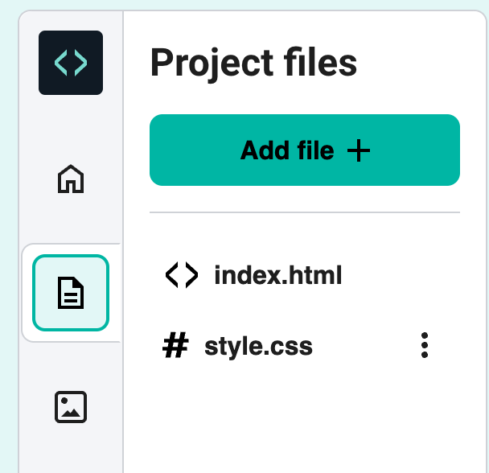

## Finishing touches

--- task ---
Select your `index.html` file in the sidebar.

--- /task ---

--- task ---
Add a horizontal line at the end of your recipe using the `
` tag.

--- code ---
---
language: html
line_numbers: true
line_number_start: 19
line_highlights: 20
---
</ol>

--- /code ---
--- /task ---

--- task --- 
Click **Run** to see the line.

--- /task ---

The line you’ve just added doesn’t match the style of the rest of your webpage.

--- task ---
Switch back to `style.css` 
--- /task ---

--- task ---
Add some CSS code to set the style of the line. Replace `???` with the colour you chose for your text.

--- code ---
---
language: css
line_numbers: true
line_number_start: 4
---
hr {
    height: 2px;
    border: none;
    background-color: ???;
}
--- /code ---

--- /task ---

--- task ---
Click **Run** to see the new style.

--- /task ---

--- task ---

Add a style to change the bullet points to squares instead of circles:

--- code ---
---
language: css
line_numbers: true
line_number_start: 9
---
ul {
    list-style-type: square;
}
--- /code ---
--- /task ---

--- task ---
Click **Run** to see the new shape.

--- /task ---