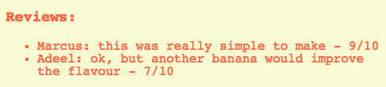
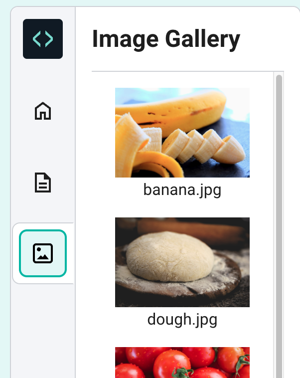

--- challenge ---
## Challenge

--- task ---

Change the background colour of your page by adding a background attribute to your `body` style in `style.css`.

--- code ---
---
language: css
line_numbers: true
line_number_start: 1
line_highlights: 3
---
body {
    color: tomato;
	background: beige;
}
--- /code ---
--- /task ---

--- task ---
Ask a few of your friends to leave a review for your recipe and add it to your site.

--- /task ---

--- task ---

Choose an image from the pictures tab and add it to your page.

{:style=“width:50%;“}

Here’s some HTML code to help you:

--- code ---
---
language: html
line_numbers: false
---

--- /code ---
--- /task ---

--- /challenge ---