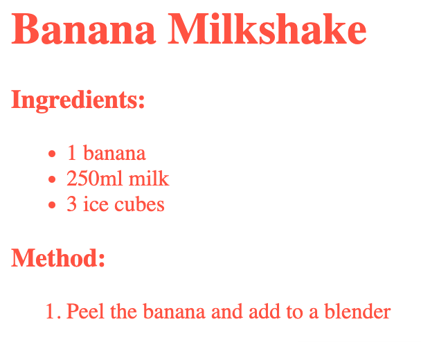
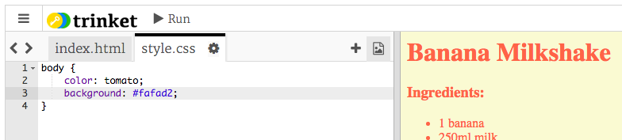

## Colours!

Let’s add some colour to your recipe webpage.


+ You’ve already learnt how to add coloured text to a webpage. Add this code inside your `style.css` file, to make all of the text in the website body blue:

```
body {
    color: blue;
}
```


+ Your browser knows colours like `blue`, `yellow` and even `lightgreen`, but did you know that your browser actually knows the __names__ of over 140 different colours?

There’s a list of all the colour names you can use: [jumpto.cc/colours](http://jumpto.cc/colours), which includes colour names like `tomato`, `firebrick` and `peachpuff`.

Change the text colour from `blue` to `tomato`.



+ Your browser knows the names of 140 colours, but actually knows the __colour values__ of more than 16 million colours!


To tell the browser which colour to display, you just need to let it know how much red, green and blue to use.

The amounts of red, green and blue are written as a number between `0` and `255`.


Add this code to the CSS for the body of the webpage, to display a light yellow background:

```
background: rgb(250,250,210);
```


+ If you prefer, you can tell the browser which colour to display by using a hexadecimal code (or __hex code__). This works in a similar way to the `rgb()` code above, except that hex codes always start with a `#`, and use hexadecimal ‘numbers’ between `00` and `ff` for the amount of red, green and blue.


Replace the `rgb()` code in your CSS with this hex code:

```
background: #fafad2;
```



You should see the same light yellow as before!


