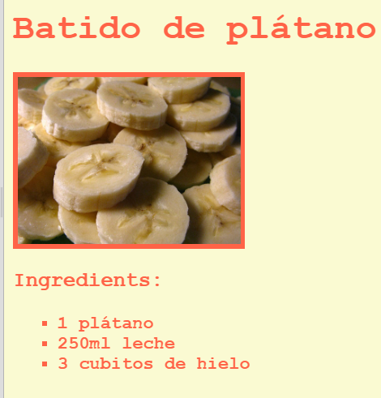

\--- challenge \---

## Desafío: Más estilos

¿Puedes añadir una imagen a tu página web? ¿O cambiar la fuente de letra? Aquí verás cómo va a quedar tu página web:

Aquí tienes el código que te va a ayudar:

    font-family: Arial / Comic Sans MS / Courier / Impact / Tahoma;
    font-size: 12pt;
    font-weight: bold;
    
    
    

\--- /challenge \---