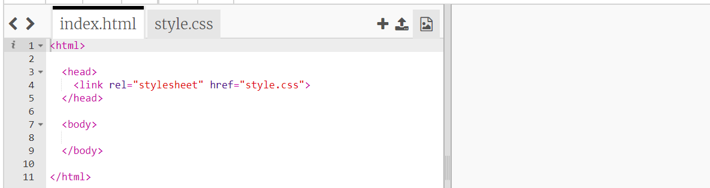
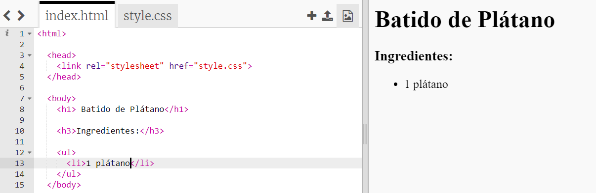

## Ingredientes

Vamos a hacer una lista con los ingredientes que necesitarás para tu receta.

+ Abre la plantilla de trinket: [jumpto.cc/html-template](http://jumpto.cc/html-template){:target="_blank"}.
    
    El proyecto debería parecerse a esto:
    
    

+ Para tu lista de ingredientes, vas a usar una **lista desordenada**, usando la etiqueta `<ul>`. Ve a la línea 8 de la plantilla y alade este código HTML, sustituyendo el texto en el`<h1>` título con el título de tu receta:

    <h1>Batido de plátano</h1>
    
    <h3>Ingredientes:</h3>
    
    <ul>
    
    </ul>
    

+ Mira tu página web, debería tener 2 cabeceros.

Si no ves tu lista aun, es porque no la hemos añadido aún!

+ El próximo paso es añadir los elementos a tu lista usando la etiqueta `<li>`. Añade el siguiente código en tu etiqueta `<ul>`:

    <li>1 plátano</li>
    

Como tu lista es desordenada, no hay números al lado de los elementos de la lista, sólo puntos de enumeración.