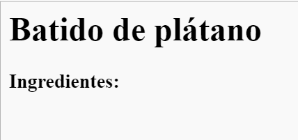

## Ingredientes

Vamos a mostrar la lista de ingredientes necesarios para tu receta.

+ Abre esta plantilla de trinket: [jumpto.cc/trinket-template](http://jumpto.cc/trinket-template). Si estás leyendo esto en el navegador incluso podrías usar la versión embebida del trinket que verás abajo.


+ Para la lista de ingredientes vamos a usar una __lista desordenada__ usando la etiqueta `<ul>`. Ve a la línea 8 de la plantilla y añade este HTML, reemplazando el texto entre las etiquetas `<h1>` con el nombre de tu receta:

```
<h1>Batido de plátano</h1>

<h3>Ingredientes:</h3>

<ul>

</ul>
```

+ Revisa tu página web, deberías ver dos encabezados.



Aún no verás los ingredientes porque todavía no has añadido ninguna lista de elementos.

+ El siguiente paso es añadir una lista de elementos en tu lista. Para ello usaremos la etiqueta `<li>`. Añade el siguiente código dentro de la etiqueta `<ul>`:

```
<li>1 plátano</li>
```


Como tu lista es una lista desordenada no hay números delante de los elementos, solo hay puntos.

