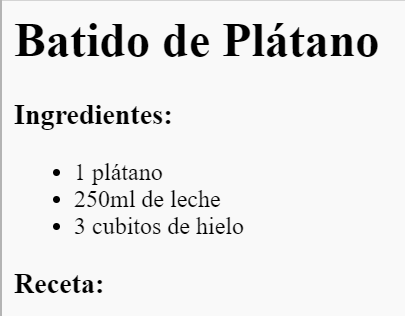
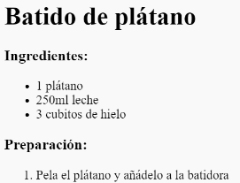

## Preparación

A continuación vamos a explicar como hacer la receta.

+ Ahora vamos a usar otra lista para escribir la preparación, pero esta vez vamos a usar una __lista ordenada__ utilizando la etiqueta `<ol>`.

Una lista ordenada es una lista numérica, que deberíamos emplear cuando el orden de los pasos es importante.

Añade este código bajo la lista de ingredientes. Asegurate de que este dentro de las etiquetas de `<body>`:

```
<h3>Preparación:</h3>

<ol>

</ol>
```



+ Ahora solo tienes que añadir la lista de elementos dentro de la nueva lista ordenada:

```
<li>Pela el plátano y mételo en la batidora</li>
```



Date cuente de que los elementos de la lista están numerado automáticamente.

