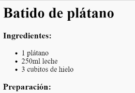

## Preparación

A continuación, vamos a explicar cómo preparar tu receta.

+ Vas a usar otra lista para escribir los pasos de preparación, pero esta vez vas a usar una **lista ordenada**, usando la etiqueta `<ol>`.

Una lista ordenada es una lista con números, que deberías usar cuando el orden de los pasos es importante.

Añade este código debajo de la lista de ingredientes, asegurándote que está dentro de la etiqueta `<body>`:
```
    <h3>Preparación:</h3>
    
    <ol>
    
    </ol>
```    



+ Ahora sólo tienes que listar los elementos en tu lista ordenada:
```
    <li>Pela el plátano y añádelo a la batidora</li>
```    


¡Fíjate que los elementos se numeran de forma automática!