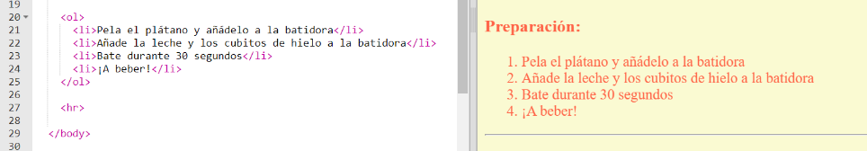
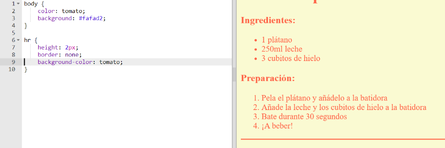

## Toques finales

Vamos a añadir un poco más de HTML y CSS para mejorar tu página web.

+ Puedes añadir una línea horizontal al final de la receta usando la etiqueta `<hr>`.



Date cuenta de que esta etiqueta no tiene etiqueta de finalización, como la etiqueta ``.

+ La línea que acabamos de añadir no encaja con el estilo del resto de la página. Vamos a arreglar esto añadiendo algo de código CSS:

```
hr {
    height: 2px;
    border: none;
    background-color: tomato;
}
```



+ Incluso puedes cambiar como son los puntos de las listas desordenadas con este código CSS:

```
ul {
    list-style-type: square;
}
```


