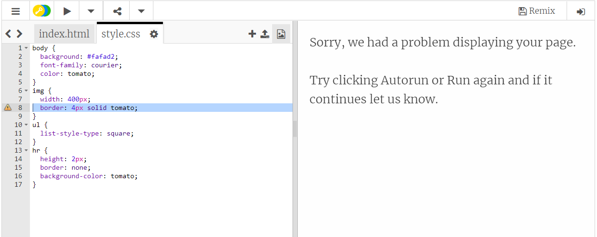

## Introducción

En este proyecto aprenderás a crear una página web para tu receta favorita.



### Información adicional para los líderes del club

Si necesitas imprimir este proyecto, usa la [versión para imprimir](https://projects.raspberrypi.org/es-LA/projects/recipe/print).

--- collapse ---
---
title: Notas para el líder del club
---

## Introducción:

En este proyecto, los niños aprenderán sobre listas de HTML y colores CSS. Crearán su propia receta, añadiendo ingredientes y la lista de pasos.

## Recursos en línea

Se recomienda el uso de [trinket](https://trinket.io/) para escribir HTML & CSS en línea.

Los niños también pueden hacer uso de este trinket en blanco [(jumpto.cc/html-blank)](http://jumpto.cc/html-blank) para escribir su propio HTML & CSS o alternativamente pueden usar esta plantilla de trinket [(jumpto.cc/html-template)](http://jumpto.cc/html-template).

También hay un trinket que contiene una solución de muestra para los desafíos:

+ [‘Receta’ terminada-- trinket.io/html/5e939efc4c](https://trinket.io/html/5e939efc4c)

## Recursos sin conexión

Este proyecto se puede [completar sin conexión](https://www.codeclubprojects.org/en-GB/resources/webdev-working-offline/) si se prefiere. Puedes acceder a los recursos del proyecto haciendo clic en el enlace 'Materiales del proyecto' para este proyecto. Este enlace contiene una sección de 'Recursos del proyecto', que incluye los recursos que los niños necesitarán para completar este proyecto sin conexión. Asegúrate de que cada niño tenga acceso a una copia de estos recursos. Esta sección incluye los siguientes archivos:

+ template/index.html
+ template/style.css

También puedes encontrar una versión completa de los desafíos de este proyecto en la sección 'Recursos para voluntarios', que contiene:

+ recipe-finished/index.html
+ recipe-finished/style.css
+ recipe-finished/banana.jpg

(Todos los recursos anteriores también se pueden descargar como archivos `.zip` de proyectos y voluntarios.)

## Objetivos del aprendizaje

+ Escribiendo HTML:
    
    + Etiquetas de lista `<ul>`, `<ol>` y `<li>`;
    + Etiqueta `<hr/>`;
    + Consolidar el uso de etiquetas indentadas.

+ Escribiendo CSS:
    
    + Colores (nombres & códigos hexadecimales).

Este proyecto incluye los siguientes aspectos del [Curríulo de Creación Digital de Raspberry Pi](https://rpf.io/curriculum):

+ [Diseño de elementos básicos en 2D y 3D](https://www.raspberrypi.org/curriculum/design/creator).

## Desafíos

"Más ingredientes" - añadir más elementos a una lista desordenada; "Más pasos" - añadir más elementos a una lista ordenada; "Más colores" - añadir nombres de colores, valores rgb y codigos hexadecimales; "Revisión" - añadir otra lista desordenada; "Más estilos" - añadir imágenes y fuentes de letra.

## Completar este proyecto sin conexión

Si los niños están completando este proyecto sin conexión, necesitarán guardar las imágenes que quieran usar en la misma carpeta que su archivo Template.html.

Después podrán simplemente añadir el nombre del archivo en sus `` etiquetas:
```
    
```    

--- /collapse ---

--- collapse ---
---
title: Materiales del proyecto
---

## Recursos del proyecto

+ [archivo .zip que contiene todos los recursos del proyecto](https://rpf.io/p/es-LA/recipe-go)
+ [Plantilla de Trinket en línea](http://jumpto.cc/trinket-template)
+ [Trinket en blanco en línea](http://jumpto.cc/trinket-blank)
+ [template/index.html](resources/template-index.html)
+ [template/style.css](resources/template-style.css)

## Recursos del líder del club

+ [archivo .zip que contiene todos los recursos del proyecto](https://rpf.io/p/es-LA/recipe-go)
+ [Proyecto Trinket completado en línea](https://trinket.io/html/5e939efc4c)
+ [recipe-finished/index.html](resources/recipe-finished-index.html)
+ [recipe-finished/style.css](resources/recipe-finished-style.css)
+ [recipe-finished/banana.png](resources/recipe-finished-banana.png)

--- /collapse ---