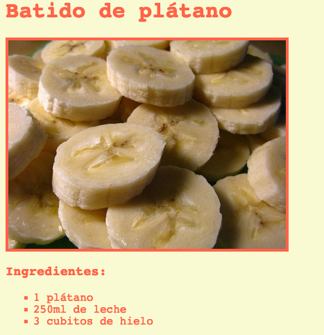

--- challenge ---

## Desafío: Más estilos

¿Puedes añadir una imagen a tu página web? ¿O cambiar la fuente de letra? Aquí verás cómo va a quedar tu página web:



Aquí tienes algo de código que puedes utilizar:
```
    font-family: Arial / Comic Sans MS / Courier / Impact / Tahoma;
    font-size: 12pt;
    font-weight: bold;
    
    
```    

--- /challenge ---


***
Este proyecto fue traducido por voluntarios:

Jonathan Saez

Natalie Gomez Benavides

Gracias a los voluntarios, podemos dar a las personas de todo el mundo la oportunidad de aprender en su propio idioma. Puedes ayudarnos a llegar a más personas ofreciéndote como voluntario para traducir. Más información en [rpf.io/translate](https://rpf.io/translate).