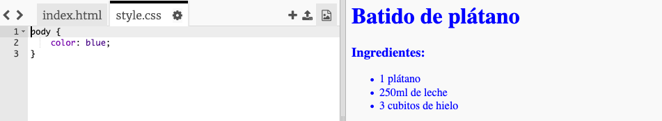

## ¡Colores!

Vamos a añadir algo de color a la página web de tu receta.

+ Ya has aprendido a añadir color al texto de tu página web. Añade este código dentro de tu archivo `style.css`, para hacer que todo el texto del cuerpo de tu página web sea azul:

    body {
        color: blue;
    }
    

+ Tu navegador conoce los colores como `blue` (azul), `yellow` (amarillo) y hasta `lightgreen` (verde claro), pero ¿sabías que tu navegador sabe los **nombres** de más de 140 colores?

Hay una lista de todos los nombres de colores que puedes usar: [ jumpto.cc/colours ](http://jumpto.cc/colours), que incluye nombres de colores como ` tomato` (tomate), ` firebrick ` (ladrillo) y ` peachpuff` (melocotón).

Cambia el color del texto de `blue` (azul) a `tomato` (tomate).

+ ¡Tu navegador sabe los nombres de 140 colores, pero de hecho sabe los **códigos de color** de más de 16 millones de colores!

Para decirle al navegador el color que debe mostrar, sólo debes decirle cuánto rojo, verde y azul debe usar.

Las cantidades de rojo, verde y azul se escriben como números entre `0` y `255`.

Añade este código al archivo CSS para mostrar un color amarillo claro de fondo al cuerpo de la página web:

    background: rgb(250,250,210);
    

+ Si lo prefieres, puedes decirle al navegador qué color mostrar usando el código hexadecimal (o **hex code**). Esto funciona de forma similar al código `rgb()` de arriba, excepto que el hex code siempre empieza con `#`, y usa números hexadecimales entre `00` y `ff` para la cantidad de rojo, verde y azul.

Sustituye el código `rgb()` en tu CSS con este hex code:

    background: #fafad2;
    

¡Deberías ver el mismo amarillo claro de antes!