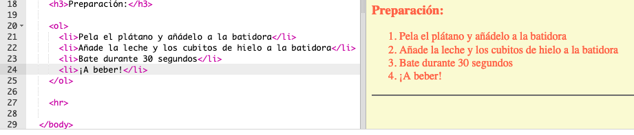
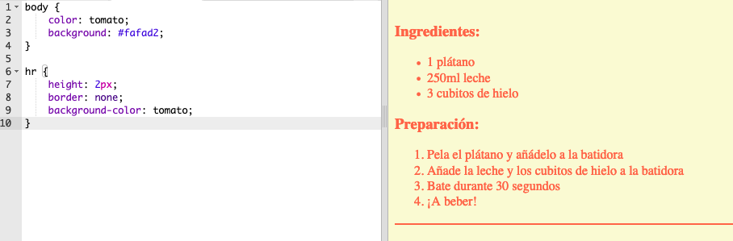
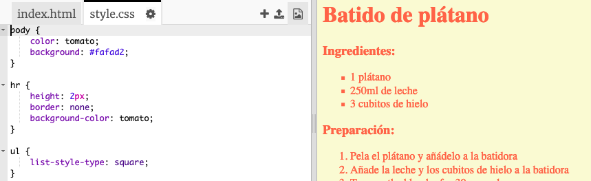

## Toques finales

Vamos a añadir un poco más de código HTML y CSS para mejorar tu página web.

+ Puedes añadir una línea horizontal al final de tu receta, usando la etiqueta `<hr>`.



Fíjate que esta etiqueta no tiene etiqueta de fin, como la etiqueta ``.

+ La línea que acabas de añadir no cuadra con el estilo de tu página web. Vamos a arreglarlo añadiendo un poco de código CSS:
```
    hr {
        height: 2px;
        border: none;
        background-color: tomato;
    }
```    



+ Hasta puedes cambiar la apariencia de los puntos de enumeración con este código CSS:
```
    ul {
        list-style-type: square;
    }
```    

