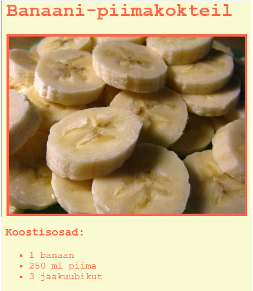

## Sissejuhatus

Selles projektis saad teada, kuidas oma lemmikretseptile veebilehte luua.

### Lisainfo ringijuhendajatele

Kui sul on vaja see projekt välja printida, siis kasuta [printerisõbralikku versiooni](https://projects.raspberrypi.org/et-EE/projects/recipe/print).

--- collapse ---
---
title: Ringijuhendaja märkmed
---

## Sissejuhatus:

Selles projektis õpivad lapsed HTML-loendeid ja CSS-värve. Nad loovad oma retsepti, lisades koostisainete ja valmistamise loendid.

## Internetiressursid

HTML-i & CSS-i kirjutamiseks soovitame kasutada [trinketit](https://trinket.io/).

Lapsed võivad kasutada ka seda tühja trinketit [(jumpto.cc/html- blank)](http://jumpto.cc/html-blank) oma HTML-i & CSS-i kirjutamiseks või alternatiivina saavad nad kasutada seda näidistrinketit [(jumpto.cc/html-memplate)](http://jumpto.cc/html-template).

Leidub ka trinket, mis sisaldab näidislahendust väljakutsetele:

+ ["Retsept" lõpetatud - trinket.io/html/c0fd9b40cd](https://trinket.io/html/083328c54b)

## Võrguvälised ressursid

Selle projekti saab soovi korral [lõpetada võrguühenduseta](https://www.codeclubprojects.org/en-GB/resources/webdev-working-offline/). Saad ligipääsu projekti ressurssidele, klõpsates selle projekti "Projekti materjalide" lingil. See link sisaldab jaotist "Projekti ressursid", mis sisaldab ressursse, mida lapsed selle projekti võrguühenduseta lõpetamiseks vajavad. Veenduge, et igal lapsel on juurdepääs nende ressursside koopiale. See jaotis sisaldab järgmisi faile:

+ template/index.html
+ template/style.css

Selle projekti väljakutsete lõpetatud versiooni leiate ka jaotisest "Vabatahtlikud ressursid", mis sisaldab järgmist:

+ recipe-finished/index.html
+ recipe-finished/style.css
+ recipe-finished/banana.jpg

(Kõik ülaltoodud ressursid on samuti alla laaditavad projekti ja vabatahtliku `.zip` failina.)

## Õpieesmärgid

+ HTML-i kirjutamine:
    
    + `<ul>`, `<ol>` ja `<li>` loendi sildid;
    + `
` silt;
    + Pesastatud siltide kasutamise konsolideerimine.

+ CSS-i kirjutamine:
    
    + Värvid (nimed & heksadetsimaalsed koodid).

Selles projektis käsitletakse elemente [Raspberry Pi digitaalse tegemise õppekava](http://rpf.io/curriculum) järgmistest valdkondadest:

+ [Disaini põhilisi 2D- ja 3D-varasid](https://www.raspberrypi.org/curriculum/design/creator).

## Väljakutsed

"Rohkem koostisosi" - järjestamata loendisse rohkemate nimetuste lisamine; "Veel samme" - järjestatud loendisse rohkemate nimetuste lisamine; "Rohkem värve" - ​​värvinimetuste, rgb väärtuste ja heksakoodide lisamine; "Arvustused" - veel ühe järjestamata loendi lisamine; "Rohkem laade" - piltide ja fontide lisamine.

## Selle projekti lõpetamine võrguühenduseta

Kui lapsed lõpetavad selle projekti võrguühenduseta, peavad nad salvestama pildid, mida nad kavatsevad kasutada samas kaustas, kus on nende Template.html fail.

Seejärel võivad nad lihtsalt lisada faili nime oma `` siltides:

    
    

--- /collapse ---

--- collapse ---
---
title: Projekti materjalid
---

## Projekti ressursid

+ [.zip-fail, mis sisaldab kõiki projekti ressursse](resources/recipe-project-resources.zip)
+ [Veebi-trinketi näidis](http://jumpto.cc/trinket-template)
+ [Tühi trinket veebis](http://jumpto.cc/trinket-blank)
+ [template/index.html](resources/template-index.html)
+ [template/style.css](resources/template-style.css)

## Ringijuhendaja ressursid

+ [.zip-fail, mis sisaldab kõiki lõpetatud projekti ressursse](resources/recipe-volunteer-resources.zip)
+ [Lõpetatud Trinketi projekt veebis](https://trinket.io/html/083328c54b)
+ [recipe-finished/index.html](resources/recipe-finished-index.html)
+ [recipe-finished/style.css](resources/recipe-finished-style.css)
+ [recipe-finished/banana.png](resources/recipe-finished-banana.png)

--- /collapse ---