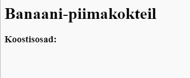
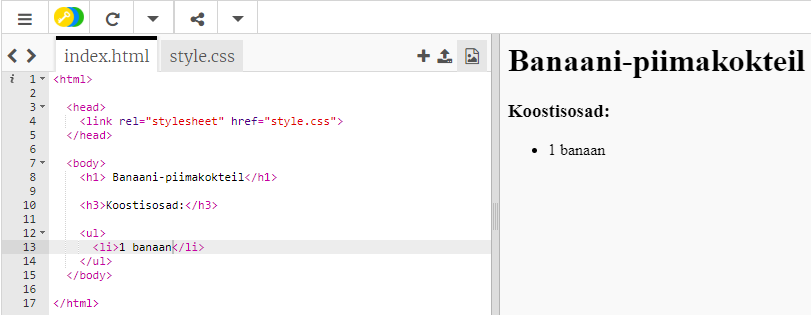

## Koostisosad

Lisage koostisosad, mis on teie retsepti jaoks vajalikud.

+ Avage see malli võlts: [jumpto.cc/html-template](http://jumpto.cc/html-template){: target = "_ blank"}.
    
    Projekt peaks olema selline:
    
    

+ Teie koostisosade loendi jaoks kasutate märgistust `<ul>` kasutades **järjestamata loendit**. Mine malli rida 8 ja lisage see HTML, asendades teksti pealkirjaga `<h1>` oma retsepti nimega:

    <h1>Banana Milkshake</h1>
    
    <h3>Koostis:</h3>
    
    <ul>
    
    </ul>
    

+ Vaadake oma veebilehte ja peate nägema oma kahte pealkirja.

Kuid te ei näe oma loendit veel, kuna te pole sellele lisanud ühtki loendielementi!

+ Järgmine samm on loendi elementide lisamine, kasutades märgist `<li>`. Lisage oma koodi `<ul>` sees järgmine kood:

    <li>1 banaan</li>
    

Kuna teie loend on ebakorrektsed, pole loendiüksuste kõrval numbreid, vaid täppide punkte.