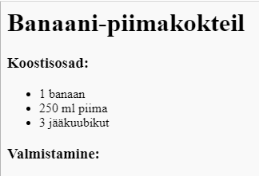
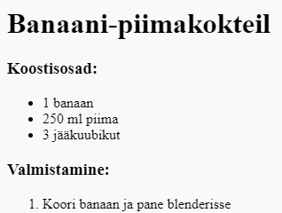

## Valmistamine

Järgnevalt selgitame, kuidas sinu retsepti valmistada.

+ Oma valmistamisjuhendi kirjutamiseks kasutad teist loendit, kuid seekord kasutad **järjestatud loendit**, kasutades silti `<ol>`.

Järjestatud loend on nummerdatud loend, mida peaksid kasutama, kui sammude järjekord on oluline.

Lisa see kood oma koostisosade loendi alla, veendudes, et see on ikka sinu `<body>` sildi sees:

    <h3>Valmistamine:</h3>
    
    <ol>
    
    </ol>
    

+ Nüüd pead lisama oma uude järjestatud loendisse nimetused:

    <li>Koori banaan ja pane blenderisse</li>
    

Pane tähele, et nimetused on automaatselt nummerdatud!