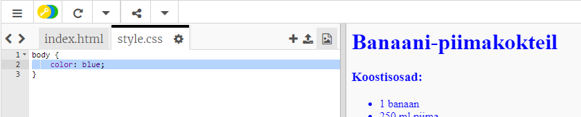
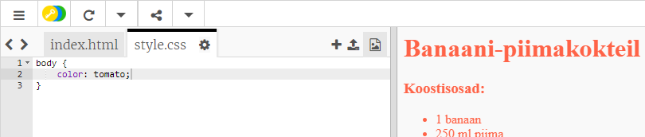
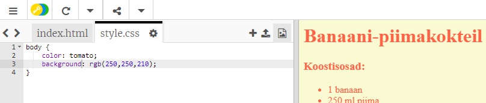
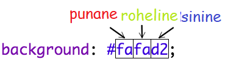
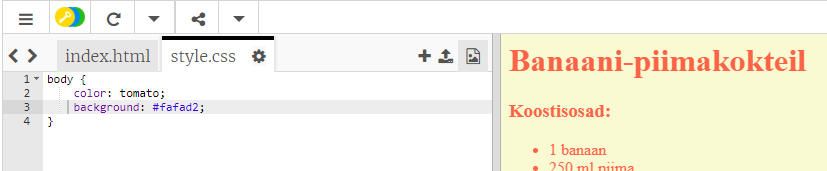

## Värvid!

Lisame teie retsepti veebilehele värvi.

+ Olete juba õppinud, kuidas värvilist teksti veebilehele lisada. Lisage see kood oma `style.css` faili sisse, et kogu veebisaidi tekst oleks sinine:

    keha {
        värv: sinine;
    }
    

+ Teie brauseril on sellised värvid nagu `sinine`, `kollane` ja isegi `lightgreen`, kuid kas teadsite, et teie brauseril on tegelikult teada rohkem kui 140 eri värvi **nimed**?

Siin on nimekiri kõikidest värvinimedest, mida saate kasutada: [jumpto.cc/colours](http://jumpto.cc/colours), mis sisaldab värvimeid nagu `tomatit`, `firebrick` ja `peachpuff`.

Muuda teksti värvi `sinist` kuni `tomatit`.

+ Teie brauser teab 140 värvi nimed, kuid tegelikult teab, et **värviväärtusega** on rohkem kui 16 miljonit värvi!

Kui soovite brausile öelda, millist värvi kuvada, peate lihtsalt teavitama sellest, kui palju punast, rohelist ja sinist värvi kasutatakse.

Punase, rohelise ja sinise kogused on kirjutatud numbritega vahemikus `0` ja `255`.

Lisage see kood veebilehe kehasse CSS-i, et kuvada helekollane taust:

    taust: rgb (250 250 250);
    

+ Kui soovite, võite öelda brauseris, milline värv kuvamiseks kasutatakse kuueteistkümnendkoodi (või **hex koodi**). See toimib sarnaselt ülaltoodud koodiga `rgb ()` , välja arvatud see, et hex koodid algavad alati `#`-ga ja kasutage kuueteistkümnemaid numbreid vahemikus `00` ja `ff` punase, rohelise ja sinine.

Asendage oma CSS-iga koodi `rgb ()` selle kuuekordse koodiga:

    taust: # fafad2;
    

Sa peaksid nägema sama helekollast nagu varem!