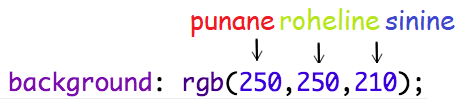

## Värvid!

Lisame sinu retsepti veebilehele natuke värvi.

+ Oled juba õppinud, kuidas veebilehele värvilist teksti lisada. Lisa see kood oma `style.css` faili sisse, et kogu veebisaidi kehatekst oleks sinine:

    body {
    color: blue;
    }
    

+ Sinu brauser tunneb selliseid värve nagu `blue`, `yellow` ja isegi `lightgreen`, kuid kas teadsid, et sinu brauseril on tunneb tegelikult rohkem kui 140 eri värvi**nimetust**?

Siin on nimekiri kõikidest värvinimetustest, mida saad kasutada: [jumpto.cc/colours](http://jumpto.cc/colours), mis sisaldab värvinimetusi nagu `tomato`, `firebrick` ja `peachpuff`.

Muuda `blue` värvi tekst `tomato` värvi tekstiks.

+ Sinu brauser teab 140 värvi nimetusi, kuid tegelikult teab ta rohkem kui 16 miljoni värvi **värviväärtuseid**!

Kui soovid brauserile öelda, millist värvi kuvada, pead talle lihtsalt teada andma, kui palju punast, rohelist ja sinist värvi kasutada.

Punase, rohelise ja sinise kogused on kirjutatud numbritega vahemikus `0` ja `255`.

Lisa see kood veebilehe CSS-kehasse, et kuvada helekollane taust:

    background: rgb(250,250,210);
    

+ Kui soovid, võid öelda brauserile, millist värvi kuvada, kasutades heksadetsimaalkoodi (ehk **heksakoodi**). See toimib sarnaselt ülaltoodud `rgb()` koodiga, välja arvatud see, et heksakoodid algavad alati `#`-ga ja kasutavad heksadetsimaal"numbreid" vahemikus `00` ja `ff` punase, rohelise ja sinise koguste jaoks.

Asenda oma CSS-is `rgb()` kood selle heksakoodiga:

    background: #fafad2;
    

Sa peaksid nägema sama helekollast nagu varem!