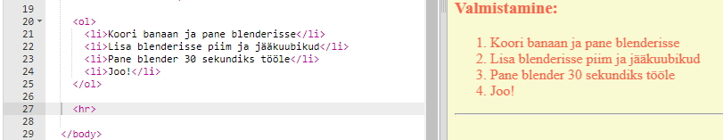
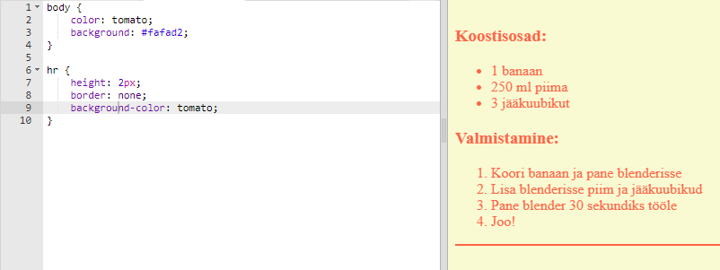
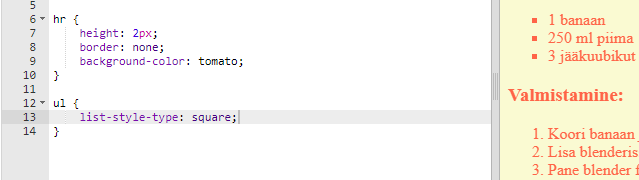

## Viimistlus

Lisame veebisaidi täiustamiseks natuke veel HTML-i ja CSS-i.

+ Saad oma retsepti lõppu lisada horisontaalse joone, kasutades `
` silti.

Pea meeles, et sellel sildil pole lõppsilti, just nagu sildil ``.

+ Joon, mille oled just lisanud, ei ühti ülejäänud veebilehe stiiliga. Lahendame selle, lisades natuke CSS-koodi:

    hr {
    height: 2px;
    border: none;
    background-color: tomato;
    }
    

+ Võid isegi muuta seda, kuidas sinu loetelupunktid välja näevad, kasutades seda CSS-koodi:

    ul {
    list-style-type: square;
    }
    

