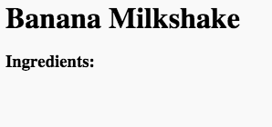

## عناصر

بیایید لیستی از مواد لازم برای دستور غذا را بدست آوریم.

+ این الگو را باز کنید: [jumpto.cc/html-template](http://jumpto.cc/html-template){: target = "_ blank"}.
    
    این پروژه باید چنین باشد:
    
    

+ برای لیست خود را از مواد تشکیل دهنده، شما در حال رفتن به استفاده از یک **لیست نامرتب**، با استفاده از `<ul>` برچسب. به خط 8 قالب بروید و این HTML را اضافه کنید، جایگزین متن در عنوان `<h1>` با نام دستور خودتان:

    <h1>موز شیرینی زنجفیلی</h1>
    
    <h3>مواد لازم:</h3>
    
    <ul>
    
    </ul>
    

+ صفحه وب خود را مشاهده کنید، و شما باید دو عنوان خود را ببینید.

شما هنوز لیست خود را نمی بینید، زیرا شما هیچ مورد لیستی را به آن اضافه نکرده اید!

+ گام بعدی اضافه کردن آیتم های لیست به لیست خود، با استفاده از برچسب `<li>`. کد زیر را در داخل خود اضافه کنید `<ul>` tag:

    <li>1 موز</li>
    

همانطور که لیست شما غیر ارادی است، عددی در کنار آیتم های لیست وجود ندارد، فقط نقاط گلوله ای.