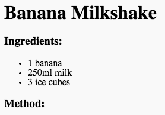

## روش

بعد، بیایید توضیح دهیم که چگونه دستورالعمل خود را آماده کنیم.

+ شما می خواهید از یک لیست دیگر برای نوشتن روش خود استفاده کنید، اما این بار با استفاده از تگ `<ol>` شما از لیست **دستورالعمل**استفاده می کنید.

لیست دستورالعمل لیست شمارشی است که باید هنگام استفاده از دستور مراحل مهم باشد.

اضافه کردن این کد زیر لیست مواد خود را، اطمینان حاصل کنید که آن را هنوز در داخل خود `<body>` برچسب:

    <h3>روش:</h3>
    
    <ol>
    
    </ol>
    

+ حالا شما فقط باید موارد لیست را در فهرست دستورالعمل جدید خود اضافه کنید:

    <li>پوست موز و اضافه کردن به یک مخلوط کن</li>
    

توجه داشته باشید که موارد لیست به صورت خودکار شماره گذاری می شوند!