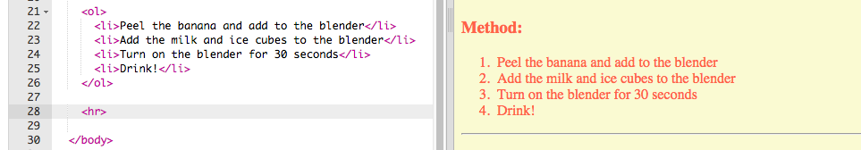
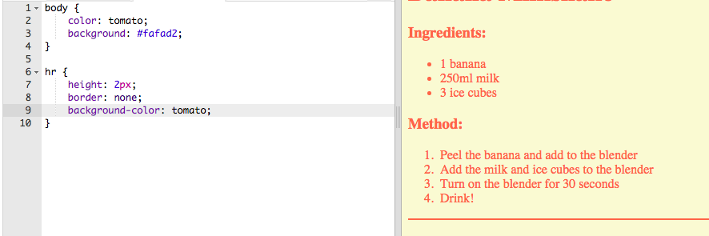

## لمس کردن پایان

اجازه دهید یک HTML و CSS کمی بیشتر برای بهبود صفحه وب خود اضافه کنیم.

+ شما می توانید یک خط افقی را در انتهای دستور خود با استفاده از برچسب `
`.

توجه داشته باشید که این برچسب تگ پایان ندارد، همانند تگ ``.

+ خط شما فقط اضافه شده با سبک بقیه صفحه وب شما مطابقت ندارد. اجازه دهید با اضافه کردن برخی از کد CSS اصلاح کنیم:

    hr {
        height: 2px؛
        مرز: هیچ؛
        پس زمینه: گوجه فرنگی؛
    }
    

+ شما حتی می توانید نقاط گلوله خود را با این کد CSS تغییر دهید:

    ul {
        list-style-type: square؛
    }
    

