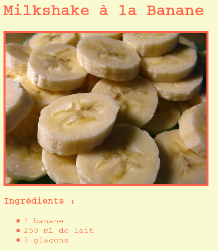

## Introduction

Dans ce projet, tu apprendras à créer une page web pour ta recette préférée.

### Informations complémentaires pour les responsables du club

Pour imprimer ce projet, merci d'utiliser la [version imprimable](https://projects.raspberrypi.org/en/projects/recipe/print).

## \--- collapse \---

## title: Notes pour le responsable du club

## Introduction :

Dans ce projet, les enfants découvriront les listes HTML et les couleurs CSS. Ils créeront leur propre recette en ajoutant des listes d'ingrédients et des étapes.

## Ressources en ligne

Nous vous recommandons d'utiliser [trinket](https://trinket.io/) pour écrire le code HTML et CSS en ligne.

Les enfants peuvent également utiliser ce trinket vide [(jumpto.cc/html-blank)](http://jumpto.cc/html-blank) pour écrire leur propre code HTML et CSS, ou utiliser ce modèle de trinket [(jumpto.cc/html-template)](http://jumpto.cc/html-template).

Il y a aussi un Trinket contenant un exemple de solution pour les défis :

+ ['Recette' terminé - trinket.io/html/c0fd9b40cd](https://trinket.io/html/c0fd9b40cd)

## Ressources hors ligne

Ce projet peut être [terminé hors ligne](https://www.codeclubprojects.org/en-GB/resources/webdev-working-offline/) si désiré. Vous pouvez accéder aux ressources du projet en cliquant sur le lien "Matériel pour le projet". Ce lien contient une section "Ressources du projet" qui inclut les ressources dont les enfants auront besoin pour compléter le projet hors ligne. Assurez-vous que les enfants ont accès à une copie de ces ressources. Cette section inclut les fichiers suivants :

+ template/index.html
+ template/style.css

Vous pouvez aussi trouver une version terminée du projet dans la section "Ressources du bénévole" qui contient:

+ recipe-finished/index.html
+ recipe-finished/style.css
+ recipe-finished/banana.jpg

(Toutes les ressources ci-dessus peuvent également être téléchargées dans les fichiers projet et bénévole au format `.zip` )

## Objectifs d'apprentissage

+ Écrire du HTML :
    
    + Les balises de liste `<ul>`, `<ol>` et `<li>`
    + La balise `
`
    + Consolider l'utilisation des balises imbriquées

+ Écrire du CSS:
    
    + Les couleurs (noms et codes hexadécimaux)

Ce projet couvre les éléments suivants du [Programme Raspberry Pi de Créativité Numérique](http://rpf.io/curriculum):

+ [Concevoir des éléments de base en 2D et 3D](https://www.raspberrypi.org/curriculum/design/creator)

## Défis

"Ajouter de nouveaux ingrédients" - ajouter des éléments à une liste non ordonnée, "Ajouter des étapes" - ajouter plusieurs éléments à une liste ordonnée, "Mettons de la couleur !" - colorer la page avec des noms de couleurs des valeurs RVB et des codes hexadécimaux, "Ajouter des commentaires" - ajouter une autre liste non ordonnée, "Plus de style" - ajouter des images et des polices.

## Terminer ce projet hors ligne

Si les enfants terminent ce projet hors ligne, ils devront enregistrer les images qu'ils ont l'intention d'utiliser dans le même dossier que leur fichier Template.html.

Ils peuvent ensuite simplement ajouter le nom du fichier dans leurs balises `` :

    
    

\--- /collapse \---

## \--- collapse \---

## title: Matériel pour le projet

## Ressources du projet

+ [Fichier .zip contenant toutes les ressources du projet](resources/recipe-project-resources.zip)
+ [Modèle de trinket en ligne](http://jumpto.cc/trinket-template)
+ [Trinket vierge en ligne](http://jumpto.cc/trinket-blank)
+ [template/index.html](resources/template-index.html)
+ [template/style.css](resources/template-style.css)

## Ressources pour le responsable du club

+ [Fichier .zip contenant toutes les ressources du projet](resources/recipe-volunteer-resources.zip)
+ [Trinket en ligne du projet terminé](https://trinket.io/html/c0fd9b40cd)
+ [recipe-finished/index.html](resources/recipe-finished-index.html)
+ [recipe-finished/style.css](resources/recipe-finished-style.css)
+ [recipe-finished/banana.png](resources/recipe-finished-banana.png)

\--- /collapse \---