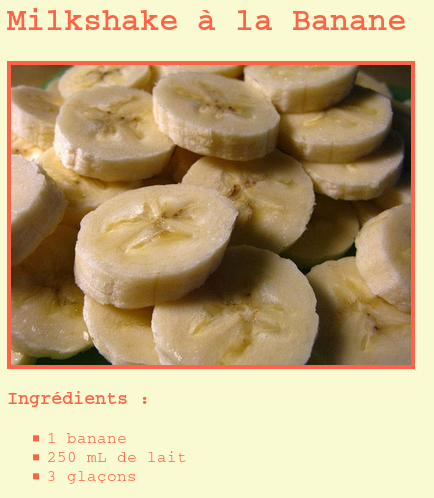

\--- challenge \---

## Défi: Plus de style

Peux-tu ajouter une image sur ta page Web ? Ou changer la police ? Voici à quoi ça pourrait ressembler :

Voici un code pour t'aider :

    font-family: Arial / Comic Sans MS / Courier / Impact / Tahoma;
    font-size: 12pt;
    font-weight: bold;
    
    
    

\--- /challenge \---