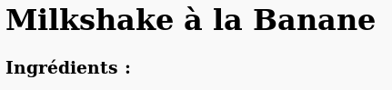
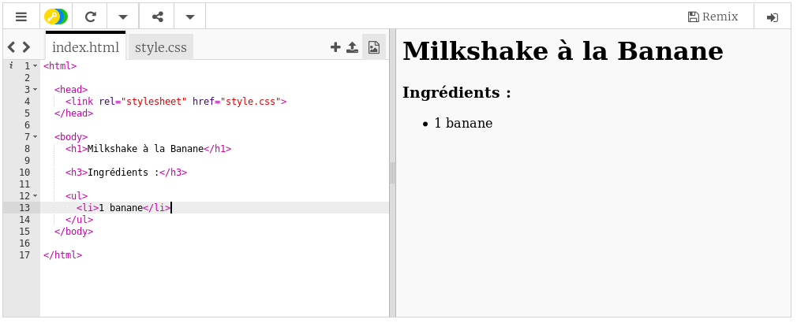

## Ingrédients

Préparons la liste des ingrédients nécessaires à ta recette.

+ Ouvre ce modèle Trinket : [jumpto.cc/html-template](http://jumpto.cc/html-template){:target="_blank"}.
    
    Le projet devrait ressembler à ceci:
    
    

+ Pour la liste d'ingrédients, tu vas utiliser une liste **non ordonnée**, à l'aide de la balise `<ul>`. À la ligne 8 du modèle, ajoute ce code HTML en remplaçant le texte du titre `<h1>` par le nom de ta recette :

    <h1>Milkshake à la banane</h1>
    
    <h3>Ingrédients:</h3>
    
    <ul>
    
    </ul>
    

+ Affiche la page Web, tu devrais voir ces deux en-têtes.

Cependant, tu ne verras pas encore la liste, car elle est encore vide !

+ L'étape suivante consiste à ajouter des éléments à la liste à l'aide de la balise `<li>`. Ajoute le code suivant dans la balise `<ul>`:

    <li>1 banane</li>
    

Comme cette liste n'est pas ordonnée, il n'y a pas de chiffres à côté des éléments de la liste, mais des puces.