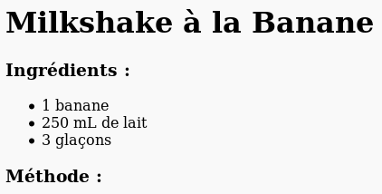
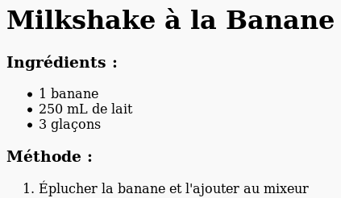

## Méthode

Ensuite, expliquons comment réaliser la recette.

+ Tu vas créer une autre liste pour écrire la méthode, mais cette fois-ci, ce sera une liste **ordonnée**. On utilisera la balise `<ol>`.

Une liste ordonnée est une liste numérotée. On l'utilise lorsque l'ordre des étapes est important.

Ajoute ce code sous la liste d'ingrédients. Vérifie ensuite qu'il est bien à l'intérieur de la balise `<body>` :

    <h3>Méthode :</h3>
    
    <ol>
    
    </ol>
    

+ Il ne te reste plus qu'à ajouter des éléments cette nouvelle liste ordonnée :

    <li>Éplucher la banane et l'ajouter au mixeur</li>
    

Les éléments de la liste sont alors automatiquement numérotés !