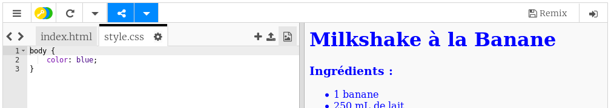
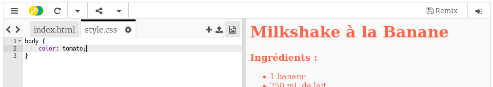
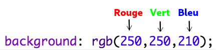
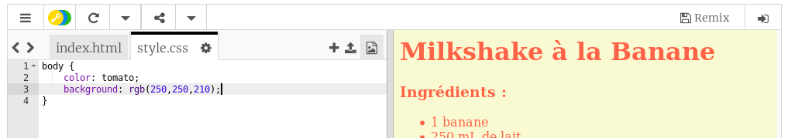
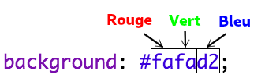
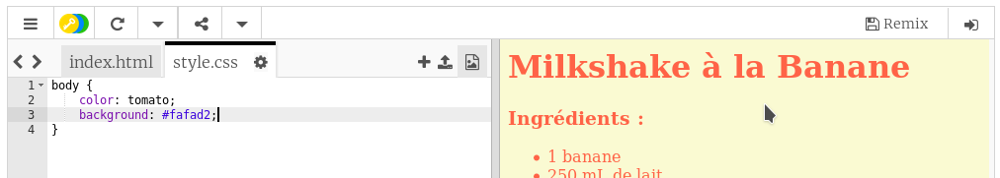

## Couleurs!

Ajoutons de la couleur à votre page de recette.

+ Vous avez déjà appris comment ajouter du texte coloré à une page Web. Ajoutez ce code dans votre fichier `style.css` , pour que tout le texte du corps du site Web soit bleu:

    corps {
        couleur: bleu;
    }
    

+ Votre navigateur connaît des couleurs telles que `bleu`, `jaune` et même `lightgreen`, mais saviez-vous que votre navigateur connaît effectivement les **noms** de plus de 140 couleurs différentes?

Tu peux utiliser une liste de tous les noms de couleurs que tu peux utiliser: [jumpto.cc/colours](http://jumpto.cc/colours) , qui inclut des noms de couleur tels que `tomato` , `firebrick` et `peachpuff` .

Changez la couleur du texte de `bleu` à `tomates`.

+ Votre navigateur connaît les noms de 140 couleurs, mais connaît en réalité les **valeurs de couleur** de plus de 16 millions de couleurs!

Pour indiquer au navigateur quelle couleur afficher, il vous suffit de lui indiquer la quantité de rouge, de vert et de bleu à utiliser.

Les quantités de rouge, de vert et de bleu s’écrivent sous la forme d’un nombre compris entre `0` et `255`.

Ajoutez ce code au CSS du corps de la page Web pour afficher un arrière-plan jaune clair:

    arrière-plan: rgb (250, 250, 210);
    

+ Si vous préférez, vous pouvez indiquer au navigateur la couleur à afficher en utilisant un code hexadécimal (ou **code hexadécimal**). Cela fonctionne de la même manière que le code `rgb ()` ci-dessus, à la différence que les codes hexadécimaux commencent toujours par un `#`et utilisent des "nombres" hexadécimaux compris entre `00` et `ff` pour la quantité de rouge, de vert et de noir. bleu.

Remplacez le code `rgb ()` dans votre CSS par ce code hexadécimal:

    arrière-plan: # fafad2;
    

Vous devriez voir le même jaune clair qu'auparavant!