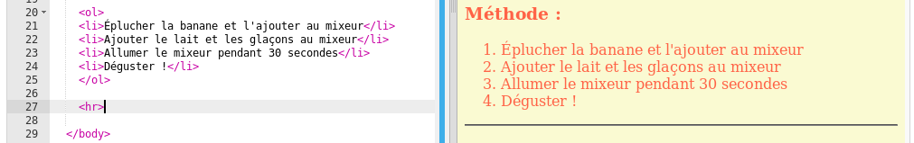
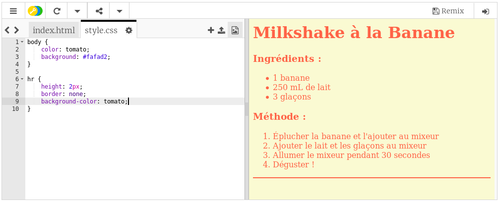

## Touches finales

Ajoutons un peu plus de HTML et de CSS pour améliorer ta page Web.

+ Tu peux ajouter une ligne horizontale à la fin de la recette en utilisant la balise `
`.

Cette balise n'a pas de balise de fin, tout comme ``.

+ La ligne que tu viens d'ajouter ne correspond pas au style du reste de la page Web. Corrigeons cela en ajoutant du code CSS :

    hr {
        height: 2px;
        border: none;
        background-color: tomato;
    }
    

+ Tu peux même changer l'apparence des puces avec ce code CSS :

    ul {
        list-style-type: square;
    }
    

